# Security Implementation

<cite>
**Referenced Files in This Document**
- [supabase.ts](file://src/lib/supabase.ts)
- [supabase-admin.ts](file://src/lib/supabase-admin.ts)
- [csrf.ts](file://src/lib/csrf.ts)
- [rate-limit.ts](file://src/lib/rate-limit.ts)
- [ip-block.ts](file://src/lib/ip-block.ts)
- [vpn-detect.ts](file://src/lib/vpn-detect.ts)
- [order-token.ts](file://src/lib/order-token.ts)
- [validation.ts](file://src/lib/validation.ts)
- [20260311_security_performance_fixes.sql](file://supabase/migrations/20260311_security_performance_fixes.sql)
- [schema.sql](file://schema.sql)
- [full_database_update.sql](file://full_database_update.sql)
- [db.ts](file://src/lib/db.ts)
- [block-ip route.ts](file://src/app/api/admin/block-ip/route.ts)
- [csrf route.ts](file://src/app/api/internal/csrf/route.ts)
- [catalog-admin-auth.ts](file://src/lib/catalog-admin-auth.ts)
- [checkout-idempotency.ts](file://src/lib/checkout-idempotency.ts)
- [logistics webhook route.ts](file://src/app/api/webhooks/logistics/route.ts)
- [whatsapp webhook route.ts](file://src/app/api/webhooks/whatsapp/route.ts)
- [orders-control route.ts](file://src/app/api/internal/orders/control/route.ts)
- [catalog-control route.ts](file://src/app/api/internal/catalog/control/route.ts)
</cite>

## Table of Contents
1. [Introduction](#introduction)
2. [Project Structure](#project-structure)
3. [Core Components](#core-components)
4. [Architecture Overview](#architecture-overview)
5. [Detailed Component Analysis](#detailed-component-analysis)
6. [Dependency Analysis](#dependency-analysis)
7. [Performance Considerations](#performance-considerations)
8. [Troubleshooting Guide](#troubleshooting-guide)
9. [Conclusion](#conclusion)
10. [Appendices](#appendices)

## Introduction
This document explains AllShop’s comprehensive security implementation for a secure ecommerce platform. It covers authentication and authorization for admin endpoints, signed tokens for order lookups, CSRF protection, rate limiting, IP blocking, VPN detection, duplicate order prevention, database security with row-level security policies, input validation, and XSS prevention. It also documents relationships with Supabase authentication, security headers configuration, monitoring, and incident response procedures.

## Project Structure
Security-related code is organized across:
- Supabase clients for public and admin operations
- API routes for admin controls and internal utilities
- Utility libraries for CSRF, rate limiting, IP blocking, VPN detection, order tokens, validation, and idempotency
- Database schema and migration files enabling row-level security and auxiliary tables for rate limiting and IP blocking

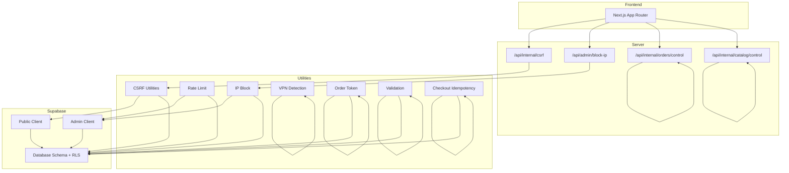

**Diagram sources**
- [csrf route.ts:1-35](file://src/app/api/internal/csrf/route.ts#L1-L35)
- [block-ip route.ts:1-140](file://src/app/api/admin/block-ip/route.ts#L1-L140)
- [orders-control route.ts:1-664](file://src/app/api/internal/orders/control/route.ts#L1-L664)
- [catalog-control route.ts:1-191](file://src/app/api/internal/catalog/control/route.ts#L1-L191)
- [csrf.ts:1-119](file://src/lib/csrf.ts#L1-L119)
- [rate-limit.ts:1-165](file://src/lib/rate-limit.ts#L1-L165)
- [ip-block.ts:1-210](file://src/lib/ip-block.ts#L1-L210)
- [vpn-detect.ts:1-101](file://src/lib/vpn-detect.ts#L1-L101)
- [order-token.ts:1-65](file://src/lib/order-token.ts#L1-L65)
- [validation.ts:1-112](file://src/lib/validation.ts#L1-L112)
- [checkout-idempotency.ts:1-33](file://src/lib/checkout-idempotency.ts#L1-L33)
- [supabase.ts:1-20](file://src/lib/supabase.ts#L1-L20)
- [supabase-admin.ts:1-31](file://src/lib/supabase-admin.ts#L1-L31)
- [schema.sql:1-230](file://schema.sql#L1-L230)
- [20260311_security_performance_fixes.sql:1-86](file://supabase/migrations/20260311_security_performance_fixes.sql#L1-L86)

**Section sources**
- [supabase.ts:1-20](file://src/lib/supabase.ts#L1-L20)
- [supabase-admin.ts:1-31](file://src/lib/supabase-admin.ts#L1-L31)
- [csrf.ts:1-119](file://src/lib/csrf.ts#L1-L119)
- [rate-limit.ts:1-165](file://src/lib/rate-limit.ts#L1-L165)
- [ip-block.ts:1-210](file://src/lib/ip-block.ts#L1-L210)
- [vpn-detect.ts:1-101](file://src/lib/vpn-detect.ts#L1-L101)
- [order-token.ts:1-65](file://src/lib/order-token.ts#L1-L65)
- [validation.ts:1-112](file://src/lib/validation.ts#L1-L112)
- [checkout-idempotency.ts:1-33](file://src/lib/checkout-idempotency.ts#L1-L33)
- [schema.sql:180-220](file://schema.sql#L180-L220)
- [20260311_security_performance_fixes.sql:22-86](file://supabase/migrations/20260311_security_performance_fixes.sql#L22-L86)

## Core Components
- Supabase public client for frontend-safe operations
- Supabase admin client for server-only privileged operations
- CSRF utilities for token generation and validation, plus same-origin checks
- Rate limiting with in-memory and DB-backed enforcement
- IP blocking system backed by a dedicated table with RLS
- VPN/Proxy detection using heuristics and optional API
- Signed order lookup tokens with TTL and safe comparison
- Input validation for checkout forms
- Duplicate order prevention via idempotency keys and database constraints
- Admin authentication via environment-controlled secrets and bearer tokens

**Section sources**
- [supabase.ts:1-20](file://src/lib/supabase.ts#L1-L20)
- [supabase-admin.ts:1-31](file://src/lib/supabase-admin.ts#L1-L31)
- [csrf.ts:1-119](file://src/lib/csrf.ts#L1-L119)
- [rate-limit.ts:1-165](file://src/lib/rate-limit.ts#L1-L165)
- [ip-block.ts:1-210](file://src/lib/ip-block.ts#L1-L210)
- [vpn-detect.ts:1-101](file://src/lib/vpn-detect.ts#L1-L101)
- [order-token.ts:1-65](file://src/lib/order-token.ts#L1-L65)
- [validation.ts:1-112](file://src/lib/validation.ts#L1-L112)
- [checkout-idempotency.ts:1-33](file://src/lib/checkout-idempotency.ts#L1-L33)
- [20260311_security_performance_fixes.sql:22-86](file://supabase/migrations/20260311_security_performance_fixes.sql#L22-L86)

## Architecture Overview
The security architecture separates concerns:
- Public client for read-only storefront operations with RLS
- Admin client for privileged operations (orders, catalog, IP/block management)
- Internal admin endpoints protected by environment-controlled secrets
- Rate limiting layered on top of Supabase for critical paths
- IP blocklist and rate limits persisted in Supabase with RLS enforced
- VPN detection as a supplementary measure with fail-open behavior

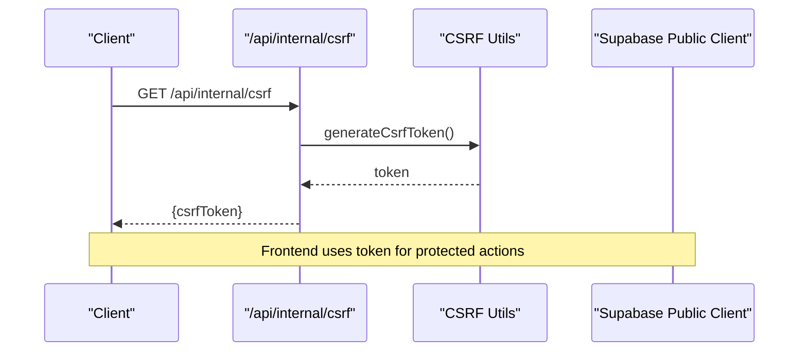

**Diagram sources**
- [csrf route.ts:1-35](file://src/app/api/internal/csrf/route.ts#L1-L35)
- [csrf.ts:40-51](file://src/lib/csrf.ts#L40-L51)
- [supabase.ts:1-20](file://src/lib/supabase.ts#L1-L20)

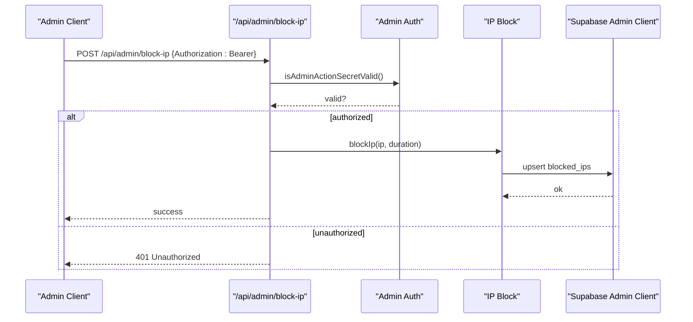

**Diagram sources**
- [block-ip route.ts:1-140](file://src/app/api/admin/block-ip/route.ts#L1-L140)
- [catalog-admin-auth.ts:27-64](file://src/lib/catalog-admin-auth.ts#L27-L64)
- [ip-block.ts:103-132](file://src/lib/ip-block.ts#L103-L132)
- [supabase-admin.ts:1-31](file://src/lib/supabase-admin.ts#L1-L31)

## Detailed Component Analysis

### Authentication and Authorization
- Admin endpoints require a bearer token derived from environment secrets. The system supports a primary secret for admin actions and a fallback to an order-lookup secret.
- Admin access codes are validated securely using constant-time comparison for the private admin panel.
- Supabase service role key enables privileged operations server-side, bypassing RLS.

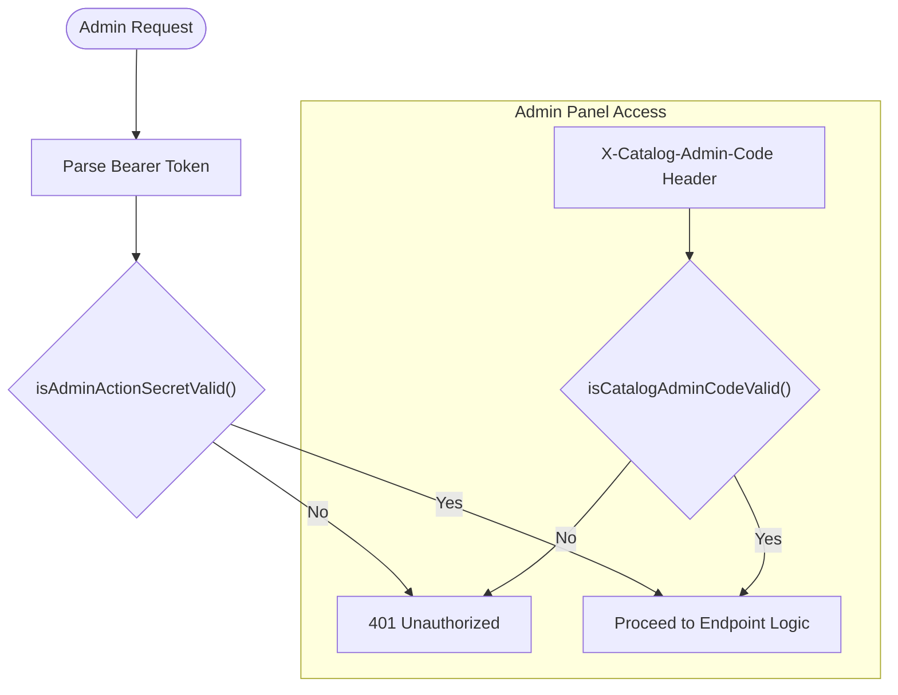

**Diagram sources**
- [block-ip route.ts:20-41](file://src/app/api/admin/block-ip/route.ts#L20-L41)
- [orders-control route.ts:55-79](file://src/app/api/internal/orders/control/route.ts#L55-L79)
- [catalog-control route.ts:24-79](file://src/app/api/internal/catalog/control/route.ts#L24-L79)
- [catalog-admin-auth.ts:27-64](file://src/lib/catalog-admin-auth.ts#L27-L64)

**Section sources**
- [block-ip route.ts:20-41](file://src/app/api/admin/block-ip/route.ts#L20-L41)
- [orders-control route.ts:55-79](file://src/app/api/internal/orders/control/route.ts#L55-L79)
- [catalog-control route.ts:24-79](file://src/app/api/internal/catalog/control/route.ts#L24-L79)
- [catalog-admin-auth.ts:1-65](file://src/lib/catalog-admin-auth.ts#L1-L65)
- [supabase-admin.ts:1-31](file://src/lib/supabase-admin.ts#L1-L31)

### CSRF Protection
- Tokens are generated server-side with HMAC-SHA256 using a configurable secret, falling back to an order-lookup secret if needed.
- Tokens include a timestamp and random part, signed with a fixed-length signature, and validated with constant-time comparison.
- Same-origin validation checks Origin and Referer headers against the host, with a strict policy in production.

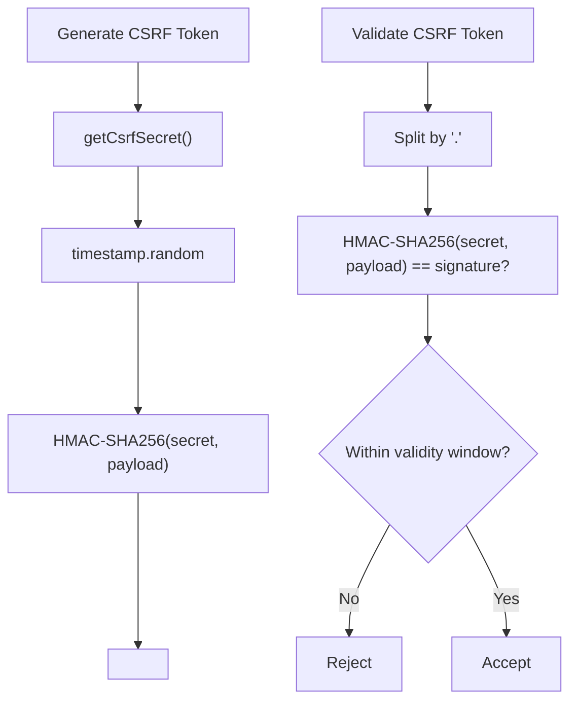

**Diagram sources**
- [csrf.ts:19-84](file://src/lib/csrf.ts#L19-L84)

**Section sources**
- [csrf.ts:1-119](file://src/lib/csrf.ts#L1-L119)
- [csrf route.ts:1-35](file://src/app/api/internal/csrf/route.ts#L1-L35)

### Signed Tokens for Order Lookup
- Order lookup tokens are signed with a secret and include an expiration timestamp.
- Validation uses constant-time comparison and ensures the token is not expired.
- Environment variable controls the TTL with strict bounds.

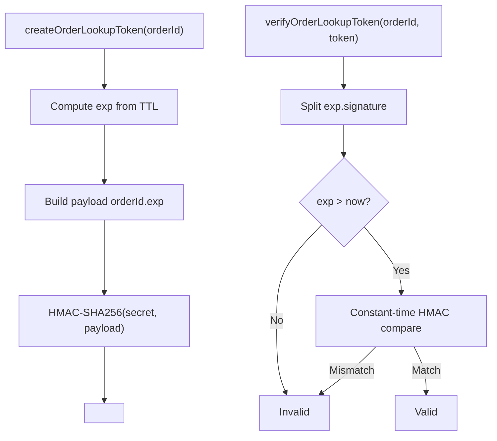

**Diagram sources**
- [order-token.ts:39-64](file://src/lib/order-token.ts#L39-L64)

**Section sources**
- [order-token.ts:1-65](file://src/lib/order-token.ts#L1-L65)

### Rate Limiting Strategies
- In-memory rate limiter provides best-effort protection per instance.
- DB-backed rate limiter uses Supabase for critical paths (checkout), with automatic fallback to in-memory if Supabase is unavailable or tables are missing.
- Supabase tables for rate limits enable cross-instance enforcement in serverless environments.

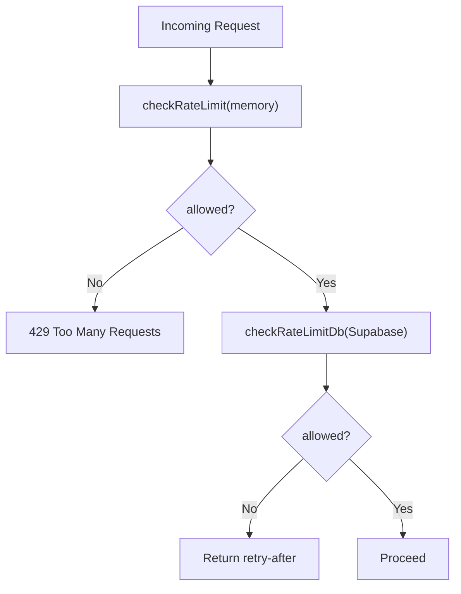

**Diagram sources**
- [rate-limit.ts:43-164](file://src/lib/rate-limit.ts#L43-L164)
- [20260311_security_performance_fixes.sql:48-71](file://supabase/migrations/20260311_security_performance_fixes.sql#L48-L71)

**Section sources**
- [rate-limit.ts:1-165](file://src/lib/rate-limit.ts#L1-L165)
- [20260311_security_performance_fixes.sql:48-71](file://supabase/migrations/20260311_security_performance_fixes.sql#L48-L71)

### IP Blocking System
- Supabase-backed IP blocklist with RLS denying client access.
- In-memory cache accelerates lookups; DB verification ensures consistency across serverless instances.
- Supports permanent, 24-hour, and 1-hour durations with asynchronous persistence.

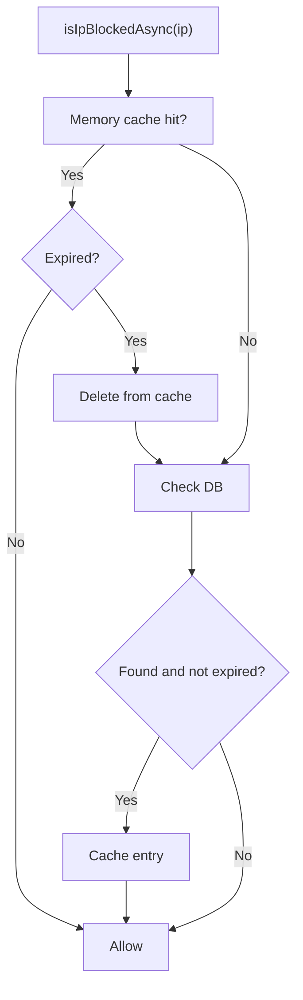

**Diagram sources**
- [ip-block.ts:25-72](file://src/lib/ip-block.ts#L25-L72)
- [20260311_security_performance_fixes.sql:22-46](file://supabase/migrations/20260311_security_performance_fixes.sql#L22-L46)

**Section sources**
- [ip-block.ts:1-210](file://src/lib/ip-block.ts#L1-L210)
- [20260311_security_performance_fixes.sql:22-46](file://supabase/migrations/20260311_security_performance_fixes.sql#L22-L46)

### VPN Detection
- Heuristic checks analyze forwarded-for chains and header patterns.
- Optional API check via a third-party service with a fail-open policy.
- Designed as a supplementary control, not a security boundary.

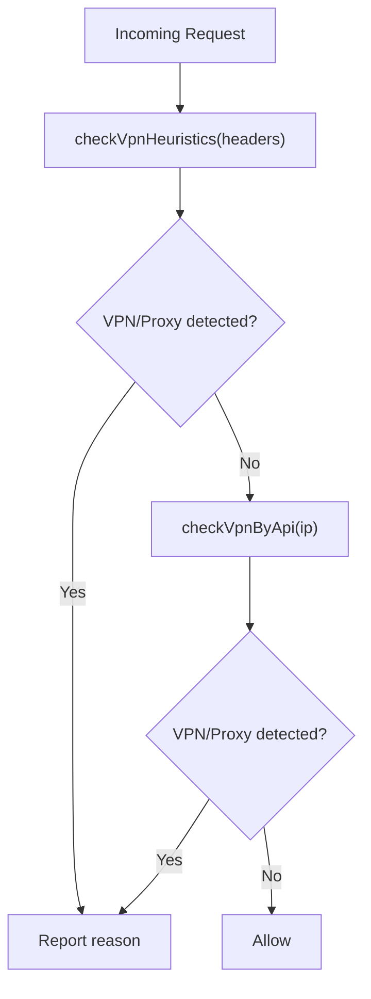

**Diagram sources**
- [vpn-detect.ts:22-100](file://src/lib/vpn-detect.ts#L22-L100)

**Section sources**
- [vpn-detect.ts:1-101](file://src/lib/vpn-detect.ts#L1-L101)

### Duplicate Order Prevention
- Idempotency keys are normalized and hashed to prevent duplicates.
- Database constraints enforce uniqueness of payment identifiers to avoid duplicate orders.
- Helper utilities detect duplicate payment ID errors and handle them gracefully.

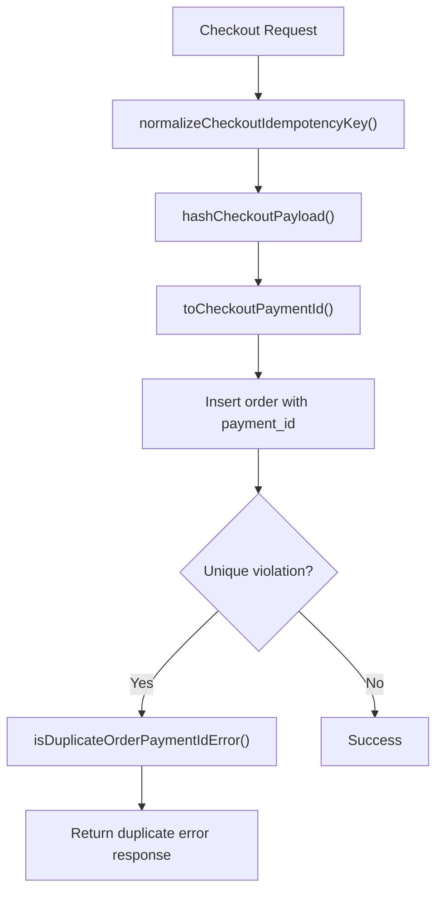

**Diagram sources**
- [checkout-idempotency.ts:5-32](file://src/lib/checkout-idempotency.ts#L5-L32)
- [full_database_update.sql:160-165](file://full_database_update.sql#L160-L165)

**Section sources**
- [checkout-idempotency.ts:1-33](file://src/lib/checkout-idempotency.ts#L1-L33)
- [full_database_update.sql:160-165](file://full_database_update.sql#L160-L165)

### Database Security and Row-Level Security
- RLS enabled on sensitive tables (orders, fulfillment logs, catalog runtime state, blocked_ips, catalog audit logs).
- Policies deny client access to admin-only tables; service role bypasses RLS for server-side operations.
- Additional indexes optimize secure queries and cleanup of expired records.

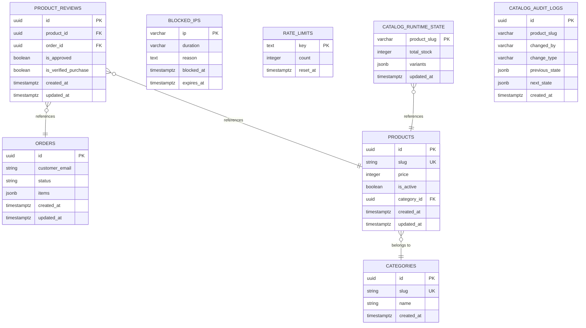

**Diagram sources**
- [schema.sql:50-128](file://schema.sql#L50-L128)
- [20260311_security_performance_fixes.sql:22-86](file://supabase/migrations/20260311_security_performance_fixes.sql#L22-L86)

**Section sources**
- [schema.sql:180-220](file://schema.sql#L180-L220)
- [20260311_security_performance_fixes.sql:22-86](file://supabase/migrations/20260311_security_performance_fixes.sql#L22-L86)

### Input Validation and XSS Prevention
- Form validation enforces strong constraints on checkout fields with localized error messages.
- Output sanitization and template rendering should escape HTML in views; ensure frontend components do not dangerously set innerHTML from untrusted data.

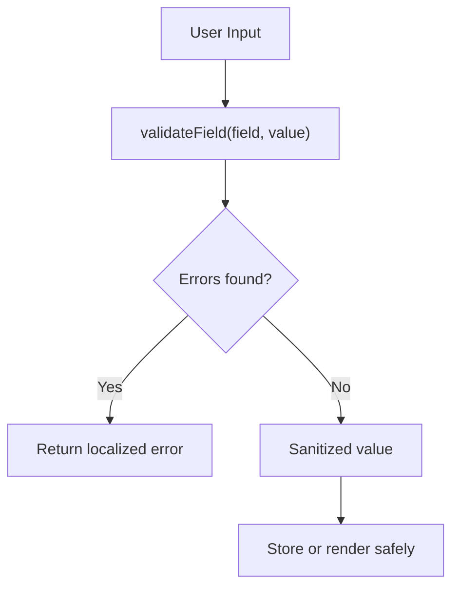

**Diagram sources**
- [validation.ts:14-110](file://src/lib/validation.ts#L14-L110)

**Section sources**
- [validation.ts:1-112](file://src/lib/validation.ts#L1-L112)

### Admin Endpoint Security
- Admin endpoints for blocking/unblocking IPs and managing orders/catalog require bearer tokens and admin codes.
- Rate limiting protects admin endpoints from abuse.
- Webhooks for logistics and WhatsApp are disabled to reduce attack surface.

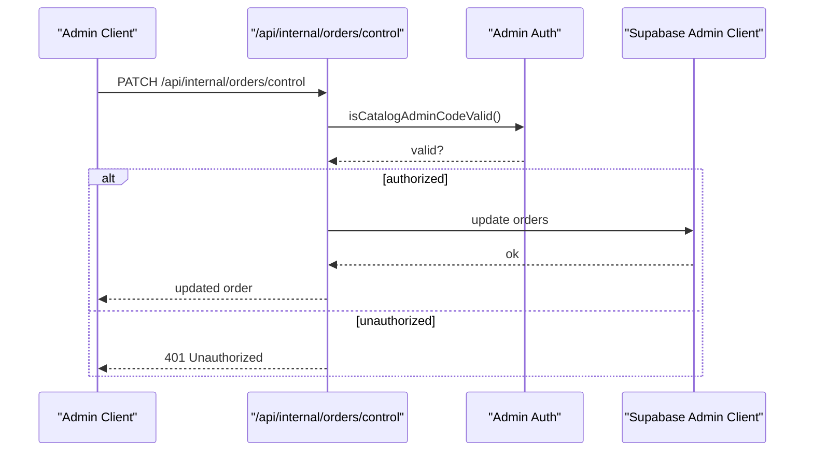

**Diagram sources**
- [orders-control route.ts:349-417](file://src/app/api/internal/orders/control/route.ts#L349-L417)
- [orders-control route.ts:55-79](file://src/app/api/internal/orders/control/route.ts#L55-L79)
- [catalog-admin-auth.ts:41-55](file://src/lib/catalog-admin-auth.ts#L41-L55)
- [supabase-admin.ts:1-31](file://src/lib/supabase-admin.ts#L1-L31)

**Section sources**
- [block-ip route.ts:51-129](file://src/app/api/admin/block-ip/route.ts#L51-L129)
- [orders-control route.ts:283-347](file://src/app/api/internal/orders/control/route.ts#L283-L347)
- [catalog-control route.ts:81-104](file://src/app/api/internal/catalog/control/route.ts#L81-L104)
- [logistics webhook route.ts:1-19](file://src/app/api/webhooks/logistics/route.ts#L1-L19)
- [whatsapp webhook route.ts:1-19](file://src/app/api/webhooks/whatsapp/route.ts#L1-L19)

## Dependency Analysis
- Supabase public client depends on environment variables for URL and anonymous key; safe defaults are used when not configured.
- Supabase admin client depends on service role key; auto-refresh and persistence are disabled for server-side use.
- Admin routes depend on admin authentication utilities and Supabase admin client.
- IP blocking and rate limiting depend on Supabase admin client for persistence.
- VPN detection optionally depends on an external API.

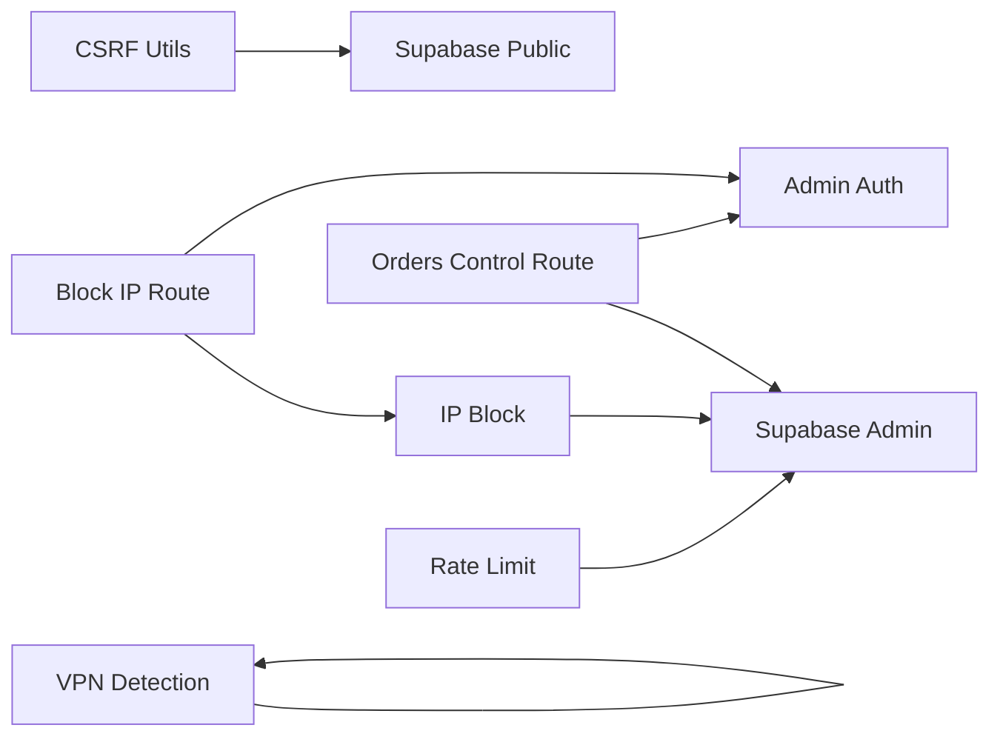

**Diagram sources**
- [supabase.ts:1-20](file://src/lib/supabase.ts#L1-L20)
- [supabase-admin.ts:1-31](file://src/lib/supabase-admin.ts#L1-L31)
- [csrf.ts:1-119](file://src/lib/csrf.ts#L1-L119)
- [rate-limit.ts:1-165](file://src/lib/rate-limit.ts#L1-L165)
- [ip-block.ts:1-210](file://src/lib/ip-block.ts#L1-L210)
- [orders-control route.ts:1-664](file://src/app/api/internal/orders/control/route.ts#L1-L664)
- [block-ip route.ts:1-140](file://src/app/api/admin/block-ip/route.ts#L1-L140)
- [catalog-admin-auth.ts:1-65](file://src/lib/catalog-admin-auth.ts#L1-L65)
- [vpn-detect.ts:1-101](file://src/lib/vpn-detect.ts#L1-L101)

**Section sources**
- [supabase.ts:1-20](file://src/lib/supabase.ts#L1-L20)
- [supabase-admin.ts:1-31](file://src/lib/supabase-admin.ts#L1-L31)
- [catalog-admin-auth.ts:1-65](file://src/lib/catalog-admin-auth.ts#L1-L65)
- [orders-control route.ts:1-664](file://src/app/api/internal/orders/control/route.ts#L1-L664)
- [block-ip route.ts:1-140](file://src/app/api/admin/block-ip/route.ts#L1-L140)

## Performance Considerations
- In-memory rate limiting is best-effort in serverless; DB-backed limits provide stronger guarantees for critical paths.
- IP blocklist uses an in-memory cache synchronized with Supabase to minimize DB calls while ensuring correctness across instances.
- VPN detection uses zero-latency heuristics and optional API calls with timeouts to avoid impacting latency.
- Database indexes improve query performance for active products, order status filtering, and cleanup of expired records.

[No sources needed since this section provides general guidance]

## Troubleshooting Guide
Common issues and resolutions:
- Missing CSRF secret in production: Ensure CSRF_SECRET or ORDER_LOOKUP_SECRET is configured; otherwise token generation fails.
- Admin endpoint 401 Unauthorized: Verify ADMIN_BLOCK_SECRET or ORDER_LOOKUP_SECRET matches the Authorization header; ensure CATALOG_ADMIN_ACCESS_CODE is set for the admin panel.
- IP blocking not effective: Confirm Supabase admin is configured and blocked_ips table exists with RLS policies applied.
- Rate limit not working: Ensure Supabase admin is configured; if DB table does not exist, fallback to in-memory only.
- Duplicate order errors: Check idempotency key normalization and database unique constraint on payment_id.

**Section sources**
- [csrf route.ts:7-15](file://src/app/api/internal/csrf/route.ts#L7-L15)
- [block-ip route.ts:25-41](file://src/app/api/admin/block-ip/route.ts#L25-L41)
- [orders-control route.ts:55-79](file://src/app/api/internal/orders/control/route.ts#L55-L79)
- [ip-block.ts:37-72](file://src/lib/ip-block.ts#L37-L72)
- [rate-limit.ts:111-112](file://src/lib/rate-limit.ts#L111-L112)
- [checkout-idempotency.ts:23-32](file://src/lib/checkout-idempotency.ts#L23-L32)

## Conclusion
AllShop’s security model combines Supabase RLS, server-side admin clients, environment-controlled secrets, and layered protections (rate limiting, IP blocking, VPN detection, CSRF, signed tokens, and input validation). These measures collectively mitigate common threats such as brute force, injection attempts, session hijacking, and abuse of administrative endpoints while maintaining a robust, scalable ecommerce platform.

[No sources needed since this section summarizes without analyzing specific files]

## Appendices

### Security Headers Configuration
- Configure security headers at the CDN or edge level (e.g., Content-Security-Policy, Strict-Transport-Security, Referrer-Policy) to complement client-side protections.
- Ensure cookies are marked as Secure, HttpOnly, and SameSite appropriate to your deployment.

[No sources needed since this section provides general guidance]

### Monitoring and Audit Logging
- Use Supabase audit logs for catalog changes and integrate with external logging systems.
- Monitor admin endpoint access, rate limit triggers, and IP block events.
- Alert on repeated failures, unusual spikes, and policy violations.

[No sources needed since this section provides general guidance]

### Incident Response Procedures
- Immediately revoke compromised secrets and rotate keys.
- Review Supabase audit logs and admin activity.
- Temporarily disable affected endpoints and apply stricter rate limits.
- Notify stakeholders and document remediation steps.

[No sources needed since this section provides general guidance]