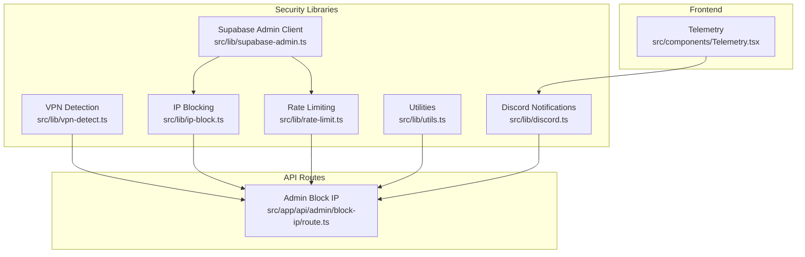
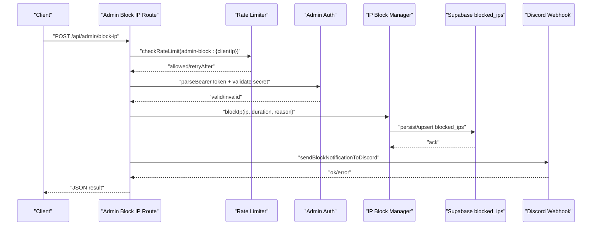
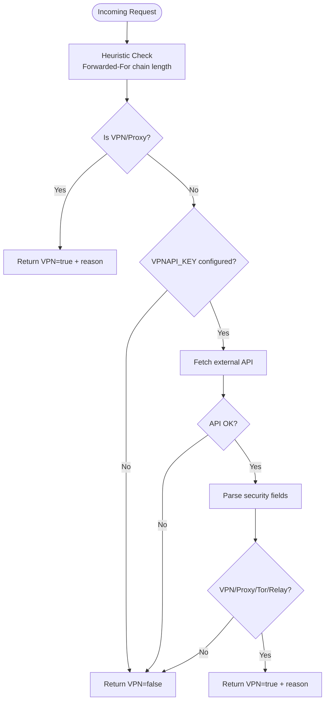
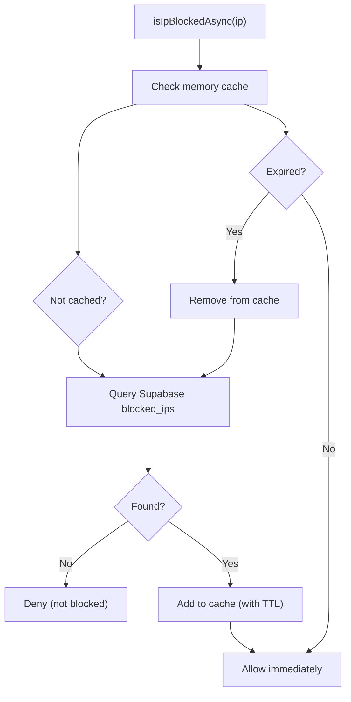
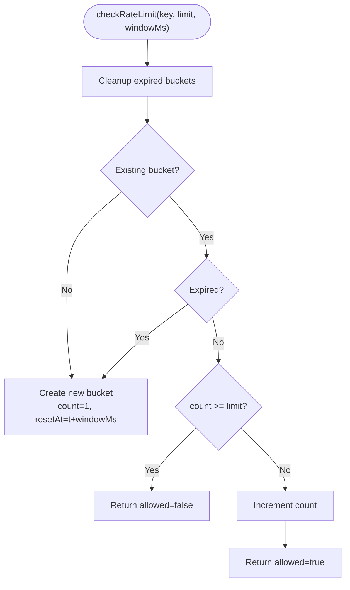
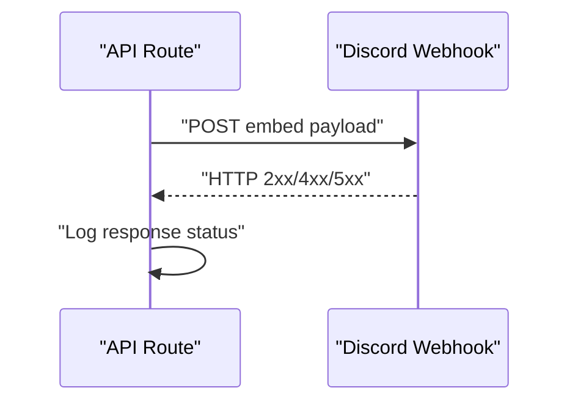
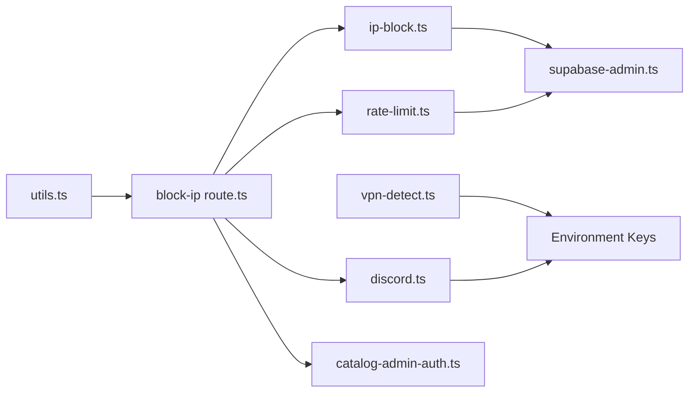

# Threat Detection & Monitoring

<cite>
**Referenced Files in This Document**
- [vpn-detect.ts](file://src/lib/vpn-detect.ts)
- [discord.ts](file://src/lib/discord.ts)
- [ip-block.ts](file://src/lib/ip-block.ts)
- [block-ip route.ts](file://src/app/api/admin/block-ip/route.ts)
- [rate-limit.ts](file://src/lib/rate-limit.ts)
- [utils.ts](file://src/lib/utils.ts)
- [Telemetry.tsx](file://src/components/Telemetry.tsx)
- [supabase-admin.ts](file://src/lib/supabase-admin.ts)
- [logistics webhook route.ts](file://src/app/api/webhooks/logistics/route.ts)
</cite>

## Table of Contents
1. [Introduction](#introduction)
2. [Project Structure](#project-structure)
3. [Core Components](#core-components)
4. [Architecture Overview](#architecture-overview)
5. [Detailed Component Analysis](#detailed-component-analysis)
6. [Dependency Analysis](#dependency-analysis)
7. [Performance Considerations](#performance-considerations)
8. [Troubleshooting Guide](#troubleshooting-guide)
9. [Conclusion](#conclusion)
10. [Appendices](#appendices)

## Introduction
This document explains AllShop’s threat detection and monitoring capabilities with a focus on:
- VPN and proxy detection for identifying potentially risky traffic and geographic anomalies
- Discord webhook-based security alerts and administrative actions
- Telemetry collection for suspicious activity signals
- Practical guidance for building custom detection rules, configuring thresholds, and integrating with external monitoring systems
- Privacy and data retention considerations
- Incident response, forensic logging, and SIEM integration
- Tuning detection sensitivity to reduce false positives while preserving protection

## Project Structure
Security and monitoring features are implemented across several modules:
- VPN detection and heuristics
- IP blocking and enforcement
- Rate limiting for abuse prevention
- Discord webhook integrations for alerts and admin actions
- Telemetry for non-sensitive operational insights
- Supabase-backed persistence for persistent state

**Diagram sources**
- [vpn-detect.ts:1-101](file://src/lib/vpn-detect.ts#L1-L101)
- [ip-block.ts:1-210](file://src/lib/ip-block.ts#L1-L210)
- [rate-limit.ts:1-165](file://src/lib/rate-limit.ts#L1-L165)
- [utils.ts:1-102](file://src/lib/utils.ts#L1-L102)
- [discord.ts:1-379](file://src/lib/discord.ts#L1-L379)
- [supabase-admin.ts:1-31](file://src/lib/supabase-admin.ts#L1-L31)
- [block-ip route.ts:1-140](file://src/app/api/admin/block-ip/route.ts#L1-L140)
- [Telemetry.tsx:1-27](file://src/components/Telemetry.tsx#L1-L27)

**Section sources**
- [vpn-detect.ts:1-101](file://src/lib/vpn-detect.ts#L1-L101)
- [ip-block.ts:1-210](file://src/lib/ip-block.ts#L1-L210)
- [rate-limit.ts:1-165](file://src/lib/rate-limit.ts#L1-L165)
- [utils.ts:1-102](file://src/lib/utils.ts#L1-L102)
- [discord.ts:1-379](file://src/lib/discord.ts#L1-L379)
- [supabase-admin.ts:1-31](file://src/lib/supabase-admin.ts#L1-L31)
- [block-ip route.ts:1-140](file://src/app/api/admin/block-ip/route.ts#L1-L140)
- [Telemetry.tsx:1-27](file://src/components/Telemetry.tsx#L1-L27)

## Core Components
- VPN/Proxy detection: lightweight heuristics plus optional external API verification
- IP blocking: in-memory cache synchronized with Supabase for enforcement across serverless instances
- Rate limiting: in-memory buckets with DB-backed enforcement for critical paths
- Discord webhook notifications: order alerts, moderation commands, and administrative notifications
- Telemetry: opt-out of sensitive paths, Vercel Analytics/Speed Insights in production

**Section sources**
- [vpn-detect.ts:1-101](file://src/lib/vpn-detect.ts#L1-L101)
- [ip-block.ts:1-210](file://src/lib/ip-block.ts#L1-L210)
- [rate-limit.ts:1-165](file://src/lib/rate-limit.ts#L1-L165)
- [discord.ts:1-379](file://src/lib/discord.ts#L1-L379)
- [Telemetry.tsx:1-27](file://src/components/Telemetry.tsx#L1-L27)

## Architecture Overview
The system combines local heuristics with centralized enforcement and alerting. VPN detection informs risk scoring; IP blocking enforces restrictions; rate limiting protects critical endpoints; Discord webhooks deliver actionable alerts and admin commands.

**Diagram sources**
- [block-ip route.ts:51-129](file://src/app/api/admin/block-ip/route.ts#L51-L129)
- [rate-limit.ts:43-88](file://src/lib/rate-limit.ts#L43-L88)
- [catalog-admin-auth.ts:27-55](file://src/lib/catalog-admin-auth.ts#L27-L55)
- [ip-block.ts:103-132](file://src/lib/ip-block.ts#L103-L132)
- [discord.ts:230-262](file://src/lib/discord.ts#L230-L262)

## Detailed Component Analysis

### VPN Detection System
Purpose:
- Identify potentially risky traffic via header heuristics and optional external API checks
- Provide fail-open behavior to avoid blocking legitimate traffic during service issues

Key behaviors:
- Heuristic checks scan the forwarded-for chain and other headers to flag suspicious patterns
- Optional API check uses an external provider when a key is configured
- Fail-open design ensures availability under API failures or timeouts

Implementation highlights:
- Heuristic evaluation occurs first for zero-latency decisions
- External API call is gated by environment configuration
- Results include a reason string suitable for alerting and auditing

**Diagram sources**
- [vpn-detect.ts:22-100](file://src/lib/vpn-detect.ts#L22-L100)

**Section sources**
- [vpn-detect.ts:1-101](file://src/lib/vpn-detect.ts#L1-L101)

### IP Blocking and Enforcement
Purpose:
- Maintain a centralized blocklist persisted in Supabase
- Enforce blocks across serverless instances using an in-memory cache synced with the database

Key behaviors:
- Memory-first lookup for speed; DB verification for correctness in serverless environments
- Support for temporary and permanent blocks with expiration handling
- Background persistence and cleanup of expired entries

**Diagram sources**
- [ip-block.ts:25-72](file://src/lib/ip-block.ts#L25-L72)

**Section sources**
- [ip-block.ts:1-210](file://src/lib/ip-block.ts#L1-L210)
- [supabase-admin.ts:1-31](file://src/lib/supabase-admin.ts#L1-L31)

### Rate Limiting
Purpose:
- Prevent brute force and abuse on critical endpoints
- Provide best-effort enforcement in serverless with DB-backed fallback for critical paths

Key behaviors:
- In-memory buckets with periodic cleanup
- DB-backed counters for critical paths (e.g., checkout) with upsert semantics
- Graceful degradation when DB is unavailable

**Diagram sources**
- [rate-limit.ts:32-88](file://src/lib/rate-limit.ts#L32-L88)

**Section sources**
- [rate-limit.ts:1-165](file://src/lib/rate-limit.ts#L1-L165)

### Discord Webhook Notifications
Purpose:
- Deliver actionable security alerts and administrative commands to a moderation channel
- Provide structured payloads for orders, blocks, cancellations, and low stock events

Key behaviors:
- Configurable webhook URL; guardrails to avoid sending when not configured
- Structured embeds with moderation commands and admin actions
- Low stock alerts include cooldown to avoid spam

**Diagram sources**
- [discord.ts:79-228](file://src/lib/discord.ts#L79-L228)

**Section sources**
- [discord.ts:1-379](file://src/lib/discord.ts#L1-L379)

### Telemetry Collection
Purpose:
- Collect non-sensitive operational telemetry in production while excluding private paths
- Use Vercel Analytics and Speed Insights for performance and visitor behavior signals

Key behaviors:
- Excludes private paths (e.g., admin panels) from telemetry
- Active only in production mode

**Section sources**
- [Telemetry.tsx:1-27](file://src/components/Telemetry.tsx#L1-L27)

### Administrative Access Control
Purpose:
- Secure admin endpoints with bearer token validation and timing-safe comparison
- Support fallbacks for admin action secrets

Key behaviors:
- Parses Authorization header for Bearer tokens
- Validates against configured secrets using constant-time comparison
- Guards admin endpoints to prevent unauthorized use

**Section sources**
- [catalog-admin-auth.ts:1-65](file://src/lib/catalog-admin-auth.ts#L1-L65)

### Utilities for IP Extraction and Validation
Purpose:
- Extract client IP reliably from trusted reverse proxy headers
- Validate IPv4/IPv6 formats for administrative actions

Key behaviors:
- Prefers x-forwarded-for and falls back to x-real-ip
- Provides basic IPv4/IPv6 validation helpers

**Section sources**
- [utils.ts:56-89](file://src/lib/utils.ts#L56-L89)

### Webhook Status (Logistics)
Purpose:
- Explicitly disable logistics webhook integration in favor of manual dispatch

Key behaviors:
- Returns 410 for both GET and POST
- Communicates manual operation policy

**Section sources**
- [logistics webhook route.ts:1-19](file://src/app/api/webhooks/logistics/route.ts#L1-L19)

## Dependency Analysis
- VPN detection depends on environment configuration for external API keys
- IP blocking relies on Supabase for persistence and synchronization across instances
- Rate limiting uses both in-memory state and Supabase for critical paths
- Discord notifications depend on a configured webhook URL
- Utilities centralize IP extraction and validation for reuse across routes

**Diagram sources**
- [vpn-detect.ts:37-96](file://src/lib/vpn-detect.ts#L37-L96)
- [ip-block.ts:10-14](file://src/lib/ip-block.ts#L10-L14)
- [rate-limit.ts:11-111](file://src/lib/rate-limit.ts#L11-L111)
- [discord.ts:6-12](file://src/lib/discord.ts#L6-L12)
- [block-ip route.ts:1-11](file://src/app/api/admin/block-ip/route.ts#L1-L11)
- [supabase-admin.ts:15-30](file://src/lib/supabase-admin.ts#L15-L30)
- [catalog-admin-auth.ts:27-31](file://src/lib/catalog-admin-auth.ts#L27-L31)
- [utils.ts:56-67](file://src/lib/utils.ts#L56-L67)

**Section sources**
- [vpn-detect.ts:1-101](file://src/lib/vpn-detect.ts#L1-L101)
- [ip-block.ts:1-210](file://src/lib/ip-block.ts#L1-L210)
- [rate-limit.ts:1-165](file://src/lib/rate-limit.ts#L1-L165)
- [discord.ts:1-379](file://src/lib/discord.ts#L1-L379)
- [block-ip route.ts:1-140](file://src/app/api/admin/block-ip/route.ts#L1-L140)
- [supabase-admin.ts:1-31](file://src/lib/supabase-admin.ts#L1-L31)
- [catalog-admin-auth.ts:1-65](file://src/lib/catalog-admin-auth.ts#L1-L65)
- [utils.ts:1-102](file://src/lib/utils.ts#L1-L102)

## Performance Considerations
- VPN detection is designed for minimal latency using heuristics first; external API calls are optional and timeout-aware
- IP blocking prioritizes memory lookups with DB verification to maintain responsiveness in serverless environments
- Rate limiting uses in-memory buckets with probabilistic cleanup to keep overhead low; DB-backed counters are reserved for critical paths
- Telemetry is disabled in non-production environments and excludes private paths to minimize overhead

[No sources needed since this section provides general guidance]

## Troubleshooting Guide
Common issues and resolutions:
- Discord webhook not sending:
  - Verify webhook URL environment variable is set
  - Check response logs for HTTP errors
- IP block not enforced:
  - Confirm Supabase admin credentials are configured
  - Ensure the blocklist table exists and is populated
- Rate limit not working:
  - For critical paths, ensure the rate_limits table exists
  - Check for DB connectivity and permissions
- VPN detection false positives:
  - Review heuristic thresholds and consider adding additional checks
  - Enable external API verification with a valid key

Operational references:
- Discord webhook configuration and error logging
- IP block persistence and memory cache behavior
- Rate limiting memory and DB fallback logic
- VPN detection heuristics and API integration

**Section sources**
- [discord.ts:215-227](file://src/lib/discord.ts#L215-L227)
- [ip-block.ts:139-171](file://src/lib/ip-block.ts#L139-L171)
- [rate-limit.ts:113-163](file://src/lib/rate-limit.ts#L113-L163)
- [vpn-detect.ts:43-83](file://src/lib/vpn-detect.ts#L43-L83)

## Conclusion
AllShop’s monitoring stack combines lightweight heuristics, centralized enforcement, and alerting to provide practical threat detection. VPN detection, IP blocking, and rate limiting form a layered defense, while Discord webhooks enable rapid response. Telemetry supports operational insights without compromising privacy. By tuning thresholds, validating configurations, and integrating with external monitoring and SIEM systems, teams can maintain strong security posture while minimizing false positives.

[No sources needed since this section summarizes without analyzing specific files]

## Appendices

### Implementation Examples

- Setting up custom threat detection rules
  - Use VPN detection results to augment risk scoring alongside other signals (e.g., failed login attempts, unusual purchase patterns)
  - Integrate with IP blocking to enforce restrictions for high-risk IPs
  - Reference:
    - [vpn-detect.ts:89-100](file://src/lib/vpn-detect.ts#L89-L100)
    - [ip-block.ts:25-72](file://src/lib/ip-block.ts#L25-L72)

- Configuring alert thresholds
  - Adjust rate limit windows and counts for sensitive endpoints
  - Tune low stock alert cooldown to balance urgency and noise
  - References:
    - [rate-limit.ts:101-164](file://src/lib/rate-limit.ts#L101-L164)
    - [discord.ts:7-8](file://src/lib/discord.ts#L7-L8)

- Integrating with external monitoring services
  - Forward telemetry to external analytics platforms via Vercel Analytics/SIEM ingestion
  - Use Discord webhooks as a bridge to external ticketing/alerting systems
  - References:
    - [Telemetry.tsx:9-26](file://src/components/Telemetry.tsx#L9-L26)
    - [discord.ts:79-228](file://src/lib/discord.ts#L79-L228)

- Privacy and data retention
  - Exclude private paths from telemetry
  - Anonymize or redact sensitive fields in alerts and logs
  - Retain audit logs (e.g., blocked IPs) per policy and purge expired entries
  - References:
    - [Telemetry.tsx:7-18](file://src/components/Telemetry.tsx#L7-L18)
    - [ip-block.ts:178-209](file://src/lib/ip-block.ts#L178-L209)

- Incident response and SIEM integration
  - Use Discord webhook payloads to trigger incident workflows
  - Persist forensic logs to Supabase for later review
  - References:
    - [discord.ts:230-315](file://src/lib/discord.ts#L230-L315)
    - [supabase-admin.ts:15-30](file://src/lib/supabase-admin.ts#L15-L30)

- Tuning detection sensitivity
  - Increase rate limit thresholds for legitimate bursts
  - Add domain-specific heuristics to reduce false positives
  - Monitor and iterate on alert rates and escalations
  - References:
    - [rate-limit.ts:43-88](file://src/lib/rate-limit.ts#L43-L88)
    - [vpn-detect.ts:22-31](file://src/lib/vpn-detect.ts#L22-L31)