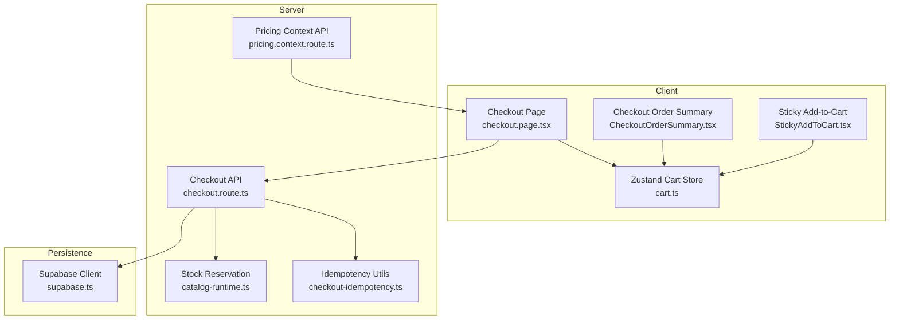
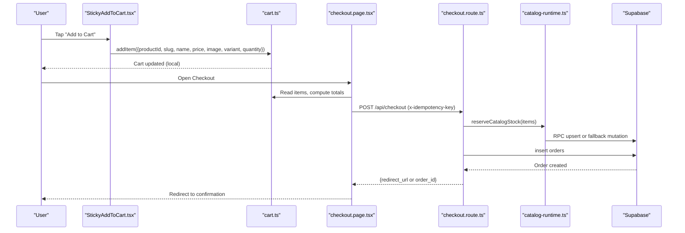
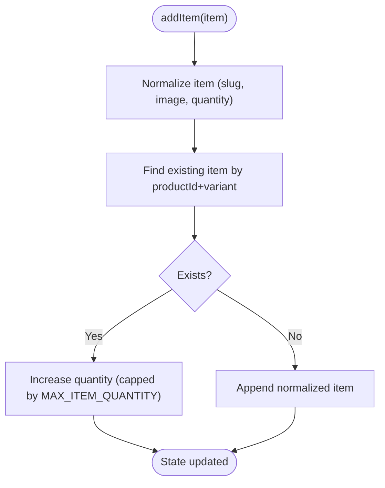
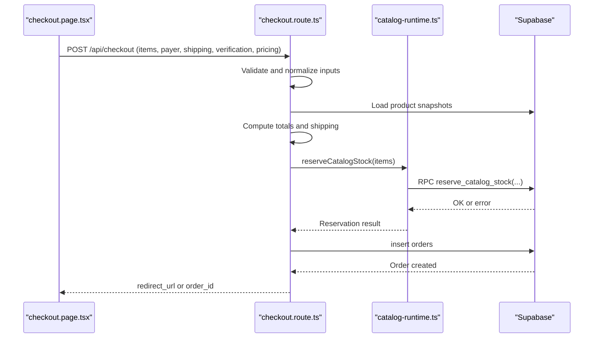
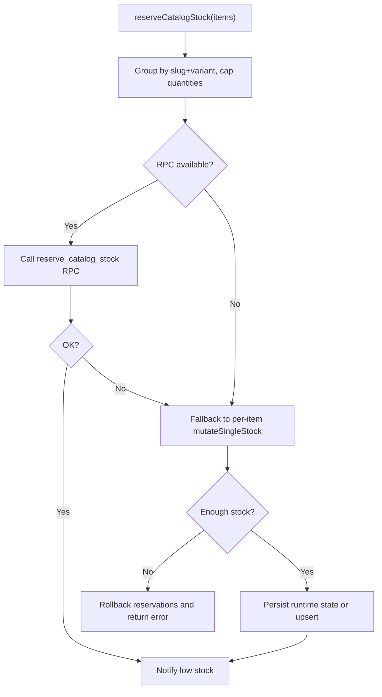
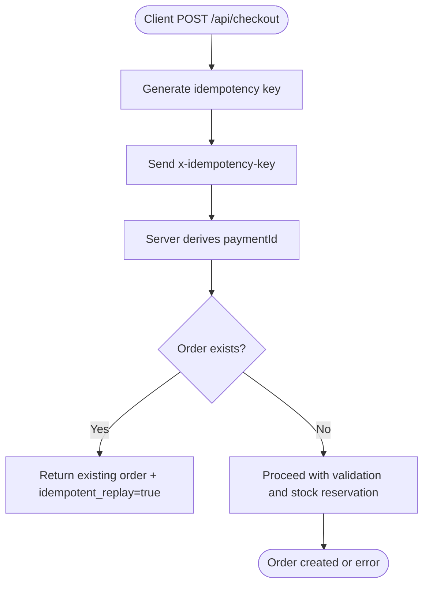
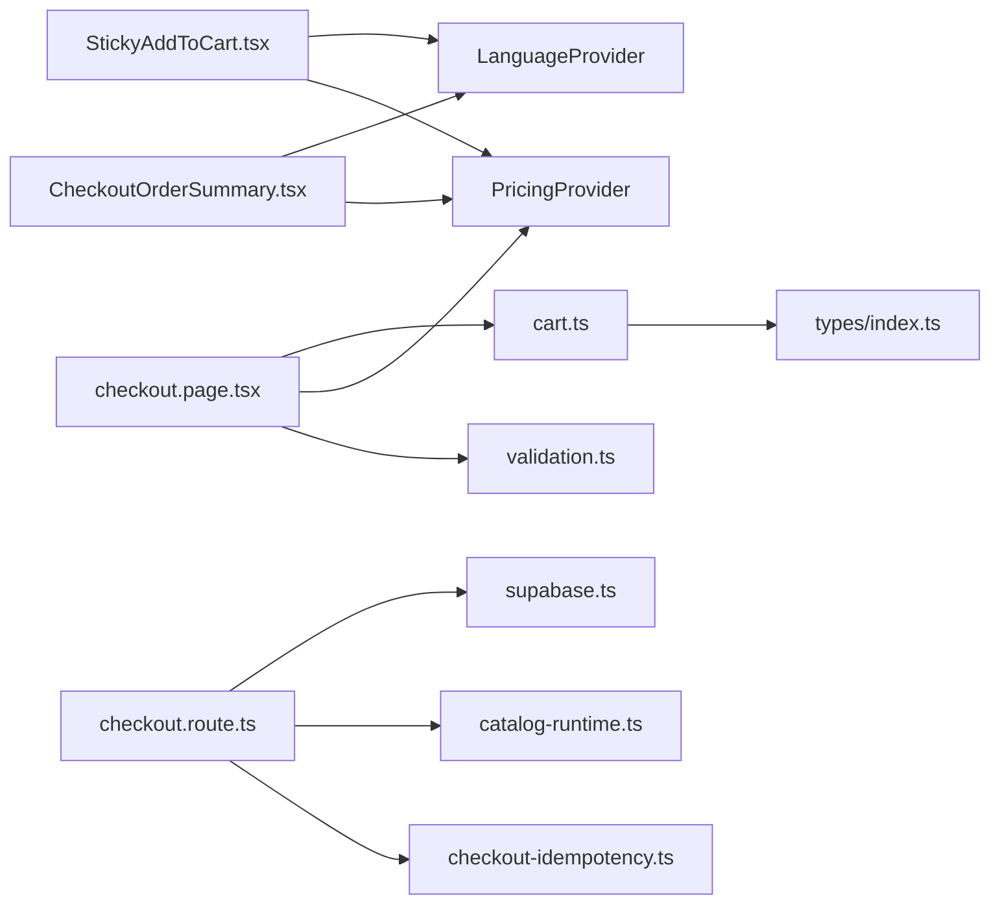

# Shopping Cart System

<cite>
**Referenced Files in This Document**
- [cart.ts](file://src/store/cart.ts)
- [StickyAddToCart.tsx](file://src/components/product/StickyAddToCart.tsx)
- [CheckoutOrderSummary.tsx](file://src/components/checkout/CheckoutOrderSummary.tsx)
- [checkout.page.tsx](file://src/app/checkout/page.tsx)
- [checkout.route.ts](file://src/app/api/checkout/route.ts)
- [supabase.ts](file://src/lib/supabase.ts)
- [catalog-runtime.ts](file://src/lib/catalog-runtime.ts)
- [checkout-idempotency.ts](file://src/lib/checkout-idempotency.ts)
- [pricing.context.route.ts](file://src/app/api/pricing/context/route.ts)
- [pricing.ts](file://src/lib/pricing.ts)
- [index.ts](file://src/types/index.ts)
</cite>

## Table of Contents
1. [Introduction](#introduction)
2. [Project Structure](#project-structure)
3. [Core Components](#core-components)
4. [Architecture Overview](#architecture-overview)
5. [Detailed Component Analysis](#detailed-component-analysis)
6. [Dependency Analysis](#dependency-analysis)
7. [Performance Considerations](#performance-considerations)
8. [Troubleshooting Guide](#troubleshooting-guide)
9. [Conclusion](#conclusion)

## Introduction
This document explains the shopping cart system implementation, focusing on state management with Zustand, persistence across sessions, quantity management with inventory validation, and integration with the product catalog. It also covers the sticky add-to-cart component, order summary display, cross-selling recommendations, checkout integration, price calculations, stock reservation mechanisms, idempotency safeguards against duplicate orders, and Supabase-backed persistent cart storage.

## Project Structure
The cart system spans client-side Zustand store, UI components, checkout orchestration, and backend APIs backed by Supabase. Key areas:
- Client store: cart state, normalization, persistence, and derived computations
- UI components: sticky add-to-cart bar and checkout order summary
- Checkout page: collects shipping and buyer info, computes totals, and posts to the checkout API
- Checkout API: validates inputs, resolves product snapshots, reserves stock, and creates orders
- Stock management: runtime stock reservations via RPC or fallback mutations
- Idempotency: prevents duplicate orders using normalized keys and duplicate detection
- Pricing: default pricing context and currency formatting

**Diagram sources**
- [cart.ts:1-149](file://src/store/cart.ts#L1-L149)
- [StickyAddToCart.tsx:1-93](file://src/components/product/StickyAddToCart.tsx#L1-L93)
- [CheckoutOrderSummary.tsx:1-193](file://src/components/checkout/CheckoutOrderSummary.tsx#L1-L193)
- [checkout.page.tsx:1-595](file://src/app/checkout/page.tsx#L1-L595)
- [checkout.route.ts:1-872](file://src/app/api/checkout/route.ts#L1-L872)
- [catalog-runtime.ts:1-1305](file://src/lib/catalog-runtime.ts#L1-L1305)
- [checkout-idempotency.ts:1-33](file://src/lib/checkout-idempotency.ts#L1-L33)
- [pricing.context.route.ts:1-13](file://src/app/api/pricing/context/route.ts#L1-L13)
- [supabase.ts:1-20](file://src/lib/supabase.ts#L1-L20)

**Section sources**
- [cart.ts:1-149](file://src/store/cart.ts#L1-L149)
- [checkout.page.tsx:1-595](file://src/app/checkout/page.tsx#L1-L595)
- [checkout.route.ts:1-872](file://src/app/api/checkout/route.ts#L1-L872)

## Core Components
- Zustand cart store with persistence and normalization
- Sticky add-to-cart component for mobile UX
- Checkout order summary with quantity controls and totals
- Checkout page orchestrating form, totals, and API submission
- Checkout API validating inputs, resolving products, reserving stock, and creating orders
- Stock reservation utilities and fallbacks
- Idempotency helpers for duplicate prevention
- Pricing context and formatting utilities

**Section sources**
- [cart.ts:39-147](file://src/store/cart.ts#L39-L147)
- [StickyAddToCart.tsx:9-93](file://src/components/product/StickyAddToCart.tsx#L9-L93)
- [CheckoutOrderSummary.tsx:22-193](file://src/components/checkout/CheckoutOrderSummary.tsx#L22-L193)
- [checkout.page.tsx:54-595](file://src/app/checkout/page.tsx#L54-L595)
- [checkout.route.ts:497-800](file://src/app/api/checkout/route.ts#L497-L800)
- [catalog-runtime.ts:1212-1305](file://src/lib/catalog-runtime.ts#L1212-L1305)
- [checkout-idempotency.ts:5-33](file://src/lib/checkout-idempotency.ts#L5-L33)
- [pricing.context.route.ts:1-13](file://src/app/api/pricing/context/route.ts#L1-L13)

## Architecture Overview
The cart system integrates client-side state with server-side validation and stock management. The checkout flow:
- Client collects buyer and shipping info, computes totals, and sends a request with an idempotency key
- Server validates inputs, resolves product snapshots, checks recent duplicates, and reserves stock
- On success, the order is persisted and the client is redirected to the confirmation page

**Diagram sources**
- [StickyAddToCart.tsx:27-34](file://src/components/product/StickyAddToCart.tsx#L27-L34)
- [cart.ts:62-81](file://src/store/cart.ts#L62-L81)
- [checkout.page.tsx:268-353](file://src/app/checkout/page.tsx#L268-L353)
- [checkout.route.ts:497-800](file://src/app/api/checkout/route.ts#L497-L800)
- [catalog-runtime.ts:1212-1281](file://src/lib/catalog-runtime.ts#L1212-L1281)

## Detailed Component Analysis

### Zustand Cart Store
The cart store encapsulates:
- State: items array, hydration flag
- Actions: replaceItems, addItem, removeItem, updateQuantity, clearCart
- Derived: getTotal, getItemCount, getShippingType
- Persistence: localStorage via Zustand persist middleware
- Hydration normalization: legacy image paths, slugs, and quantities

Key behaviors:
- addItem merges by productId + variant, caps quantity at a fixed maximum
- updateQuantity supports zero to remove items and enforces the cap
- getShippingType determines national/international/mixed based on item stock locations
- onRehydrateStorage normalizes persisted items and updates state if needed

**Diagram sources**
- [cart.ts:62-81](file://src/store/cart.ts#L62-L81)
- [cart.ts:11-31](file://src/store/cart.ts#L11-L31)

**Section sources**
- [cart.ts:39-147](file://src/store/cart.ts#L39-L147)
- [index.ts:3-14](file://src/types/index.ts#L3-L14)

### Sticky Add-to-Cart Component
Purpose:
- Provide a mobile-friendly, always-visible action to add the current product to the cart
- Handle variant selection by scrolling to the top when required

Behavior:
- Displays product image, name, and formatted price
- On click: if variant is required, scrolls to top; otherwise triggers onAddToCart
- Uses language and pricing providers for localization and currency formatting

Integration:
- Receives price, product name, image, and requiresVariant props
- Calls parent-provided onAddToCart to add the item to the Zustand store

**Section sources**
- [StickyAddToCart.tsx:9-93](file://src/components/product/StickyAddToCart.tsx#L9-L93)

### Checkout Order Summary
Purpose:
- Render the cart items, quantities, and computed totals
- Allow inline quantity adjustments and removals
- Display shipping type and secure payment badges

Behavior:
- Maps items to a list with thumbnails, variant info, quantity controls (+/-), and remove button
- Computes subtotal, shipping cost, and total
- Shows free shipping badge when applicable
- Provides a primary checkout button with loading state and icons

Integration:
- Receives items, subtotal, shippingCost, total, shippingType, and callbacks for updates/removal
- Uses pricing providers for display/payment formatting

**Section sources**
- [CheckoutOrderSummary.tsx:22-193](file://src/components/checkout/CheckoutOrderSummary.tsx#L22-L193)

### Checkout Page Orchestration
Responsibilities:
- Collects buyer and shipping information
- Computes totals locally (subtotal, shipping, total)
- Validates form fields and confirmations
- Submits to the checkout API with an idempotency key and CSRF token
- Handles redirects to order confirmation

Highlights:
- Reads cart items from the Zustand store
- Calculates shipping cost considering free-shipping products and optional custom shipping costs
- Builds the payload with normalized product slugs and variant info
- Clears the cart upon successful order creation

**Section sources**
- [checkout.page.tsx:54-595](file://src/app/checkout/page.tsx#L54-L595)

### Checkout API: Validation, Product Resolution, Stock Reservation, and Order Creation
Responsibilities:
- Input validation and sanitization
- Product snapshot resolution from Supabase
- Duplicate order detection and idempotency handling
- Stock reservation via RPC or fallback mutation
- Order insertion and idempotent replay support

Key steps:
- Normalize and merge checkout items, cap quantities
- Resolve product snapshots by ID or slug, with fallbacks
- Build priced items and compute subtotal
- Determine shipping cost based on free-shipping and optional custom shipping
- Reserve stock and rollback on failure
- Insert order with notes and metadata
- Detect duplicate payment IDs and return existing order

**Diagram sources**
- [checkout.page.tsx:268-353](file://src/app/checkout/page.tsx#L268-L353)
- [checkout.route.ts:497-800](file://src/app/api/checkout/route.ts#L497-L800)
- [catalog-runtime.ts:1212-1281](file://src/lib/catalog-runtime.ts#L1212-L1281)

**Section sources**
- [checkout.route.ts:172-196](file://src/app/api/checkout/route.ts#L172-L196)
- [checkout.route.ts:255-352](file://src/app/api/checkout/route.ts#L255-L352)
- [checkout.route.ts:354-388](file://src/app/api/checkout/route.ts#L354-L388)
- [checkout.route.ts:390-408](file://src/app/api/checkout/route.ts#L390-L408)
- [checkout.route.ts:455-475](file://src/app/api/checkout/route.ts#L455-L475)
- [checkout.route.ts:482-495](file://src/app/api/checkout/route.ts#L482-L495)
- [checkout.route.ts:663-685](file://src/app/api/checkout/route.ts#L663-L685)
- [checkout.route.ts:759-799](file://src/app/api/checkout/route.ts#L759-L799)

### Stock Reservation Mechanisms
Two strategies:
- RPC-based reservation via catalog_runtime_state table
- Fallback mutation with optimistic concurrency and retry logic

Features:
- Group items by slug and variant, sum quantities
- Attempt RPC reservation; if unavailable, fall back to per-item decrement with conflict handling
- Notify low stock thresholds after reservations
- Restore stock on errors or idempotent replays

**Diagram sources**
- [catalog-runtime.ts:1212-1281](file://src/lib/catalog-runtime.ts#L1212-L1281)
- [catalog-runtime.ts:293-338](file://src/lib/catalog-runtime.ts#L293-L338)
- [catalog-runtime.ts:667-875](file://src/lib/catalog-runtime.ts#L667-L875)

**Section sources**
- [catalog-runtime.ts:1212-1305](file://src/lib/catalog-runtime.ts#L1212-L1305)

### Idempotency and Duplicate Prevention
Mechanisms:
- Client generates a UUID-based idempotency key and attaches it as a header
- Server normalizes the key and derives a paymentId
- Checks for existing order by paymentId; if present, returns redirect to confirmation
- Detects duplicate paymentId errors from the database and replays the existing order

**Diagram sources**
- [checkout.page.tsx:250-255](file://src/app/checkout/page.tsx#L250-L255)
- [checkout.route.ts:499-502](file://src/app/api/checkout/route.ts#L499-L502)
- [checkout.route.ts:643-661](file://src/app/api/checkout/route.ts#L643-L661)
- [checkout.route.ts:766-787](file://src/app/api/checkout/route.ts#L766-L787)
- [checkout-idempotency.ts:5-33](file://src/lib/checkout-idempotency.ts#L5-L33)

**Section sources**
- [checkout-idempotency.ts:5-33](file://src/lib/checkout-idempotency.ts#L5-L33)
- [checkout.route.ts:499-502](file://src/app/api/checkout/route.ts#L499-L502)
- [checkout.route.ts:643-661](file://src/app/api/checkout/route.ts#L643-L661)
- [checkout.route.ts:766-787](file://src/app/api/checkout/route.ts#L766-L787)

### Pricing Context and Formatting
- Pricing context endpoint returns currency, locale, conversion rates, and display rate
- The checkout page uses pricing providers to format display and payment amounts
- Currency resolution considers country and language defaults

**Section sources**
- [pricing.context.route.ts:1-13](file://src/app/api/pricing/context/route.ts#L1-L13)
- [pricing.ts:1-146](file://src/lib/pricing.ts#L1-L146)
- [checkout.page.tsx:62-70](file://src/app/checkout/page.tsx#L62-L70)

## Dependency Analysis
- Client store depends on:
  - Types for CartItem
  - Legacy slug/image normalization utilities
  - Zustand persist middleware for localStorage
- UI components depend on:
  - Language provider for i18n
  - Pricing provider for currency formatting
- Checkout page depends on:
  - Zustand store for cart state
  - Validation utilities
  - Pricing provider for display/payment formatting
- Checkout API depends on:
  - Supabase client for product and order persistence
  - Stock reservation utilities
  - Idempotency helpers
  - Shipping and delivery utilities

**Diagram sources**
- [cart.ts:1-10](file://src/store/cart.ts#L1-L10)
- [index.ts:1-30](file://src/types/index.ts#L1-L30)
- [StickyAddToCart.tsx:1-8](file://src/components/product/StickyAddToCart.tsx#L1-L8)
- [CheckoutOrderSummary.tsx:1-20](file://src/components/checkout/CheckoutOrderSummary.tsx#L1-L20)
- [checkout.page.tsx:17-25](file://src/app/checkout/page.tsx#L17-L25)
- [checkout.route.ts:2-48](file://src/app/api/checkout/route.ts#L2-L48)
- [supabase.ts:1-20](file://src/lib/supabase.ts#L1-L20)
- [catalog-runtime.ts:1-12](file://src/lib/catalog-runtime.ts#L1-L12)
- [checkout-idempotency.ts:1-33](file://src/lib/checkout-idempotency.ts#L1-L33)

**Section sources**
- [cart.ts:1-10](file://src/store/cart.ts#L1-L10)
- [checkout.page.tsx:17-25](file://src/app/checkout/page.tsx#L17-L25)
- [checkout.route.ts:2-48](file://src/app/api/checkout/route.ts#L2-L48)

## Performance Considerations
- Cart normalization and hydration:
  - Normalize legacy image paths and slugs during hydration to avoid repeated conversions
  - Cap item quantities to reduce computation overhead and prevent oversized payloads
- Stock reservation:
  - Group items by slug+variant to minimize database calls
  - Prefer RPC-based reservations when available for atomicity and throughput
- UI responsiveness:
  - Keep cart updates local-first; defer heavy server-side work to checkout
  - Debounce or batch UI updates for quantity changes
- Pricing:
  - Cache pricing context and rates to avoid frequent network requests
- Storage:
  - Persist only essential cart data; avoid storing large images or metadata
- Large cart optimization:
  - Consider pagination or virtualization for order summary lists
  - Lazy-load images and defer non-critical UI rendering

[No sources needed since this section provides general guidance]

## Troubleshooting Guide
Common issues and resolutions:
- Cart not persisting across sessions:
  - Verify the Zustand persist configuration and localStorage availability
  - Ensure the onRehydrateStorage handler runs and normalizes items
- Quantity not updating:
  - Confirm updateQuantity is called with correct productId/variant
  - Check the MAX_ITEM_QUANTITY cap and zero-quantity removal behavior
- Stock reservation failures:
  - Insufficient stock: server returns 409 with a message; inform the user and suggest alternatives
  - RPC missing: fallback mutation applies; ensure runtime table exists and is up-to-date
- Duplicate orders:
  - Idempotency key not sent: client regenerates and retries
  - PaymentId conflict: server detects and returns existing order
- Session expiration:
  - CSRF token refresh: client fetches token before checkout submission
  - Rehydrate hydration flag ensures UI waits until cart is hydrated
- Cross-device synchronization:
  - Local cart is device-specific; consider integrating a server-backed cart via Supabase if needed
  - For now, rely on local persistence and idempotency to avoid duplication

**Section sources**
- [cart.ts:125-147](file://src/store/cart.ts#L125-L147)
- [checkout.page.tsx:250-266](file://src/app/checkout/page.tsx#L250-L266)
- [checkout.route.ts:674-683](file://src/app/api/checkout/route.ts#L674-L683)
- [checkout.route.ts:766-787](file://src/app/api/checkout/route.ts#L766-L787)

## Conclusion
The shopping cart system combines a lightweight, normalized Zustand store with robust server-side validation, product resolution, and stock reservation. The sticky add-to-cart and checkout order summary provide strong UX, while idempotency and duplicate detection ensure reliable order processing. Supabase underpins product catalogs and order persistence, enabling scalable growth. For cross-device synchronization, consider extending the client store to integrate with server-backed cart storage.