# Technology Stack

<cite>
**Referenced Files in This Document**
- [package.json](file://package.json)
- [next.config.ts](file://next.config.ts)
- [tsconfig.json](file://tsconfig.json)
- [postcss.config.mjs](file://postcss.config.mjs)
- [src/app/layout.tsx](file://src/app/layout.tsx)
- [src/lib/supabase.ts](file://src/lib/supabase.ts)
- [src/lib/db.ts](file://src/lib/db.ts)
- [sql/01_schema.sql](file://sql/01_schema.sql)
- [src/store/cart.ts](file://src/store/cart.ts)
- [src/providers/LanguageProvider.tsx](file://src/providers/LanguageProvider.tsx)
- [src/lib/i18n.ts](file://src/lib/i18n.ts)
- [src/components/Telemetry.tsx](file://src/components/Telemetry.tsx)
- [src/components/FacebookPixel.tsx](file://src/components/FacebookPixel.tsx)
- [src/providers/PricingProvider.tsx](file://src/providers/PricingProvider.tsx)
- [src/lib/pricing.ts](file://src/lib/pricing.ts)
- [src/lib/delivery.ts](file://src/lib/delivery.ts)
- [src/app/page.tsx](file://src/app/page.tsx)
- [README.md](file://README.md)
</cite>

## Table of Contents
1. [Introduction](#introduction)
2. [Project Structure](#project-structure)
3. [Core Components](#core-components)
4. [Architecture Overview](#architecture-overview)
5. [Detailed Component Analysis](#detailed-component-analysis)
6. [Dependency Analysis](#dependency-analysis)
7. [Performance Considerations](#performance-considerations)
8. [Troubleshooting Guide](#troubleshooting-guide)
9. [Conclusion](#conclusion)

## Introduction
This document describes the technology stack and architecture of AllShop (operational name Vortixy), a Next.js 16 e-commerce platform focused on the Colombian market. It covers the frontend (Next.js App Router, React 19, Tailwind CSS), backend services (Supabase/PostgreSQL with custom RPC functions), state management (Zustand), internationalization (React i18n), analytics (Vercel Analytics and Speed Insights, Facebook Pixel), and deployment-related infrastructure. It also documents dependency management, build processes, and development tools, and explains the architectural choices that align with serving Colombian customers and enabling efficient operations.

## Project Structure
The project follows a conventional Next.js 16 App Router layout with a strict TypeScript configuration and Tailwind CSS v4 pipeline. The frontend is organized around pages and server components under src/app, shared UI components under src/components, providers for cross-cutting concerns under src/providers, domain logic under src/lib, state management under src/store, and types under src/types. Backend assets include SQL schema and stored procedures under sql/.

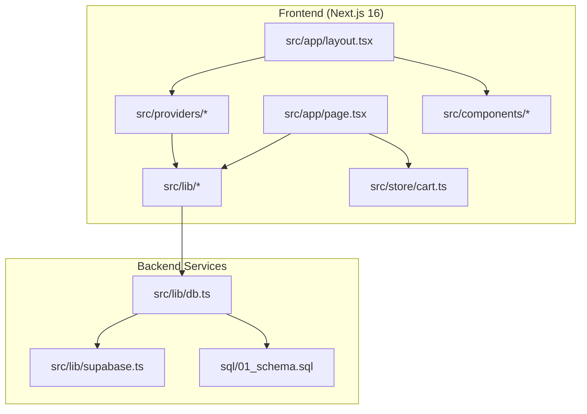

**Diagram sources**
- [src/app/layout.tsx:112-202](file://src/app/layout.tsx#L112-L202)
- [src/app/page.tsx:1-26](file://src/app/page.tsx#L1-L26)
- [src/lib/db.ts:1-309](file://src/lib/db.ts#L1-L309)
- [src/lib/supabase.ts:1-20](file://src/lib/supabase.ts#L1-L20)
- [sql/01_schema.sql:1-496](file://sql/01_schema.sql#L1-L496)

**Section sources**
- [package.json:1-49](file://package.json#L1-L49)
- [next.config.ts:1-117](file://next.config.ts#L1-L117)
- [tsconfig.json:1-43](file://tsconfig.json#L1-L43)
- [postcss.config.mjs:1-8](file://postcss.config.mjs#L1-L8)

## Core Components
- Frontend framework: Next.js 16 with App Router and server components for SEO, ISR-like caching, and server-rendered content.
- UI library: React 19 with modern hooks patterns and concurrent features.
- Styling: Tailwind CSS v4 with a PostCSS pipeline for utility-first styling.
- Backend: Supabase for database and authentication, PostgreSQL with custom RPC functions for transactional stock reservation and restoration.
- State management: Zustand for lightweight, scalable client-side state (cart).
- Internationalization: React i18n with a fixed Spanish (Colombia) locale and server-side translation resolution.
- Analytics and marketing: Vercel Analytics and Speed Insights for performance monitoring; Facebook Pixel for conversion tracking.
- Deployment and security: Next.js security headers, CSP delegated to proxy, and production-ready image optimization.

**Section sources**
- [package.json:12-26](file://package.json#L12-L26)
- [next.config.ts:53-117](file://next.config.ts#L53-L117)
- [src/lib/supabase.ts:1-20](file://src/lib/supabase.ts#L1-L20)
- [src/lib/db.ts:1-309](file://src/lib/db.ts#L1-L309)
- [src/store/cart.ts:1-149](file://src/store/cart.ts#L1-L149)
- [src/providers/LanguageProvider.tsx:1-81](file://src/providers/LanguageProvider.tsx#L1-L81)
- [src/lib/i18n.ts:1-29](file://src/lib/i18n.ts#L1-L29)
- [src/components/Telemetry.tsx:1-27](file://src/components/Telemetry.tsx#L1-L27)
- [src/components/FacebookPixel.tsx:1-64](file://src/components/FacebookPixel.tsx#L1-L64)

## Architecture Overview
The system is a full-stack Next.js application with a clear separation of concerns:
- Presentation and routing live in Next.js pages and server components.
- Business logic and data access are encapsulated in src/lib and src/providers.
- State is managed client-side with Zustand.
- Data persistence and identity are handled by Supabase/PostgreSQL, with custom RPC functions for stock operations.
- Analytics and telemetry are integrated at the application level.

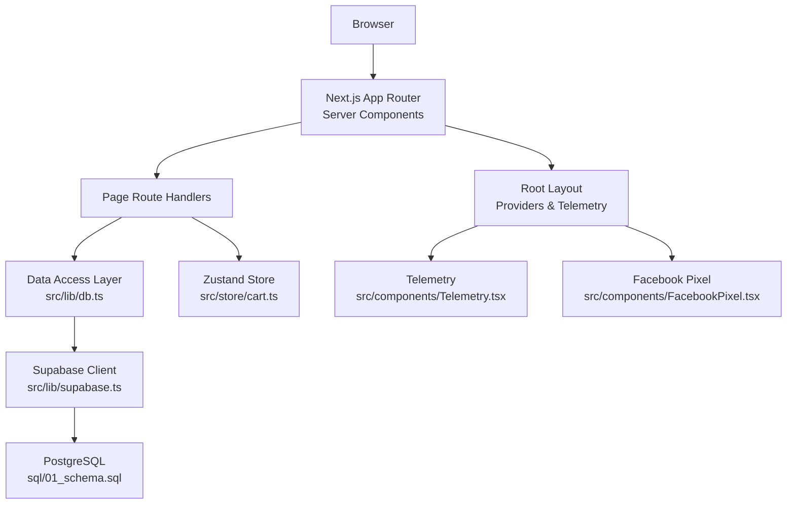

**Diagram sources**
- [src/app/layout.tsx:112-202](file://src/app/layout.tsx#L112-L202)
- [src/app/page.tsx:1-26](file://src/app/page.tsx#L1-L26)
- [src/lib/db.ts:1-309](file://src/lib/db.ts#L1-L309)
- [src/lib/supabase.ts:1-20](file://src/lib/supabase.ts#L1-L20)
- [sql/01_schema.sql:1-496](file://sql/01_schema.sql#L1-L496)
- [src/store/cart.ts:1-149](file://src/store/cart.ts#L1-L149)
- [src/components/Telemetry.tsx:1-27](file://src/components/Telemetry.tsx#L1-L27)
- [src/components/FacebookPixel.tsx:1-64](file://src/components/FacebookPixel.tsx#L1-L64)

## Detailed Component Analysis

### Frontend: Next.js 16 with App Router and Server Components
- Root layout configures metadata, Open Graph, Twitter cards, and schema.org structured data for SEO and social sharing.
- Providers wrap the app to inject language, pricing, and toast contexts.
- Telemetry and Facebook Pixel are included conditionally in production.
- Image optimization is configured with remote patterns from Supabase and custom hosts, and robust cache headers are applied in production.

```mermaid
sequenceDiagram
participant Browser as "Browser"
participant Layout as "Root Layout"
participant Providers as "Providers"
participant Telemetry as "Telemetry"
participant Pixel as "FacebookPixel"
Browser->>Layout : Request /
Layout->>Providers : Initialize Language, Pricing, Toast
Layout->>Telemetry : Inject Analytics (prod only)
Layout->>Pixel : Inject Pixel SDK (prod only)
Layout-->>Browser : Render HTML with structured data
```

**Diagram sources**
- [src/app/layout.tsx:112-202](file://src/app/layout.tsx#L112-L202)
- [src/components/Telemetry.tsx:9-26](file://src/components/Telemetry.tsx#L9-L26)
- [src/components/FacebookPixel.tsx:29-63](file://src/components/FacebookPixel.tsx#L29-L63)

**Section sources**
- [src/app/layout.tsx:1-203](file://src/app/layout.tsx#L1-L203)
- [next.config.ts:53-117](file://next.config.ts#L53-L117)

### Backend: Supabase and PostgreSQL with Custom RPC Functions
- Supabase client initialization guards against missing credentials and falls back to safe defaults for local development.
- Data access layer abstracts category, product, and review queries, with slug normalization and deduplication logic.
- PostgreSQL schema defines tables for categories, products, orders, reviews, fulfillment logs, and runtime catalog state.
- Custom RPC functions reserve and restore catalog stock atomically, ensuring consistency during checkout.

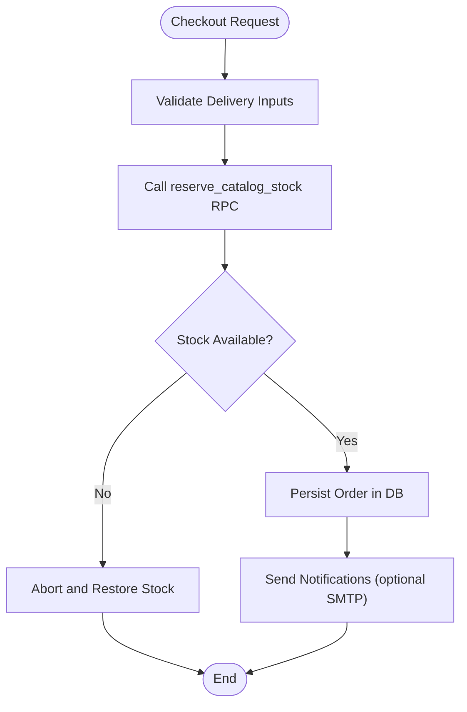

**Diagram sources**
- [src/lib/db.ts:253-395](file://src/lib/db.ts#L253-L395)
- [sql/01_schema.sql:253-395](file://sql/01_schema.sql#L253-L395)

**Section sources**
- [src/lib/supabase.ts:1-20](file://src/lib/supabase.ts#L1-L20)
- [src/lib/db.ts:1-309](file://src/lib/db.ts#L1-L309)
- [sql/01_schema.sql:1-496](file://sql/01_schema.sql#L1-L496)

### State Management: Zustand Cart Store
- Client-side cart state with persistence to localStorage/session storage.
- Normalization of legacy product slugs and images to ensure compatibility.
- Quantity caps and shipping type classification (national/international/mixed) derived from cart items.

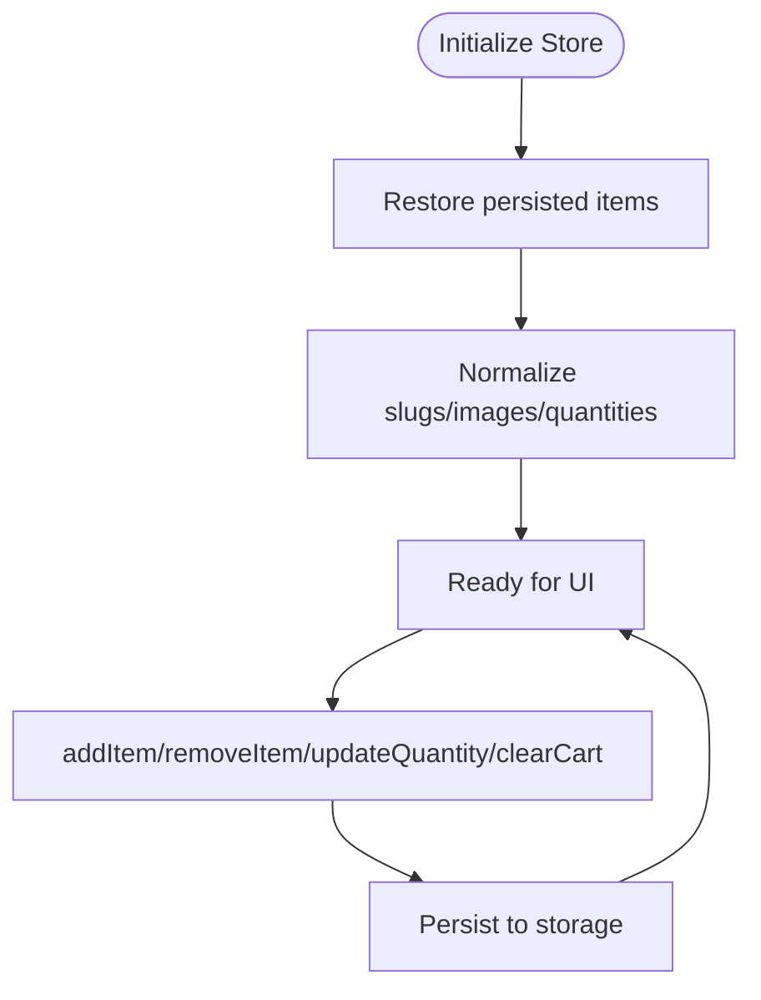

**Diagram sources**
- [src/store/cart.ts:53-147](file://src/store/cart.ts#L53-L147)

**Section sources**
- [src/store/cart.ts:1-149](file://src/store/cart.ts#L1-L149)

### Internationalization: React i18n with Fixed Spanish (Colombia)
- LanguageProvider sets a fixed language (Spanish) and persists it to localStorage and cookies.
- Translation resolution prioritizes overrides and falls back to Spanish for missing keys.
- Server-side translation function resolves language deterministically for SSR.

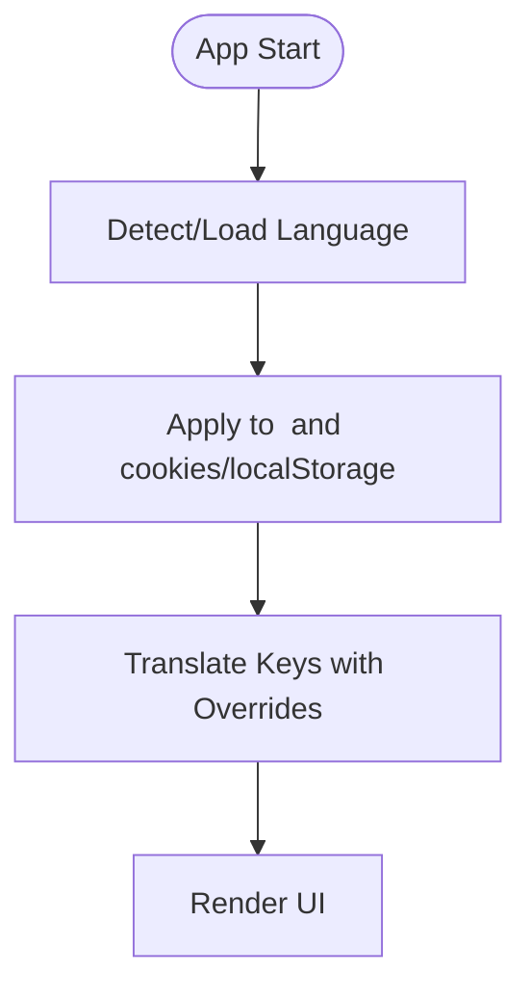

**Diagram sources**
- [src/providers/LanguageProvider.tsx:44-75](file://src/providers/LanguageProvider.tsx#L44-L75)
- [src/lib/i18n.ts:15-28](file://src/lib/i18n.ts#L15-L28)

**Section sources**
- [src/providers/LanguageProvider.tsx:1-81](file://src/providers/LanguageProvider.tsx#L1-L81)
- [src/lib/i18n.ts:1-29](file://src/lib/i18n.ts#L1-L29)

### Analytics and Marketing: Vercel Analytics, Speed Insights, and Facebook Pixel
- Telemetry component injects Vercel Analytics and Speed Insights in production and excludes admin/private routes.
- Facebook Pixel initializes the SDK and tracks page views in production, with configurable pixel ID.

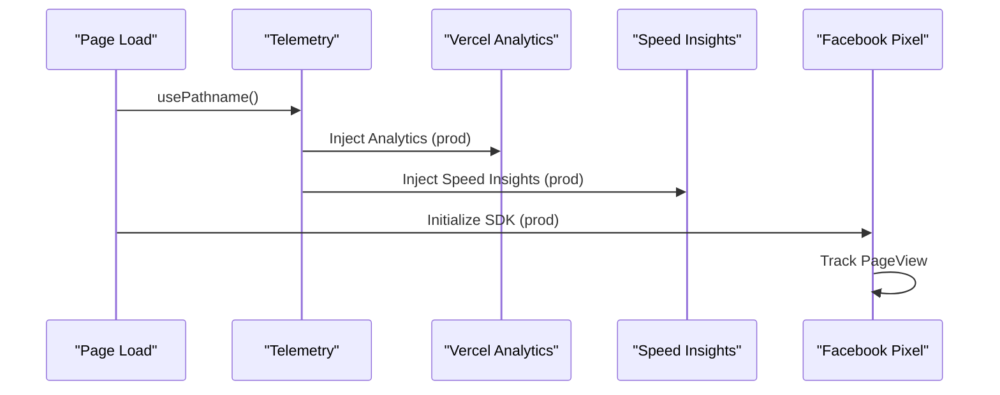

**Diagram sources**
- [src/components/Telemetry.tsx:9-26](file://src/components/Telemetry.tsx#L9-L26)
- [src/components/FacebookPixel.tsx:29-63](file://src/components/FacebookPixel.tsx#L29-L63)

**Section sources**
- [src/components/Telemetry.tsx:1-27](file://src/components/Telemetry.tsx#L1-L27)
- [src/components/FacebookPixel.tsx:1-64](file://src/components/FacebookPixel.tsx#L1-L64)

### Pricing and Locale: Colombia-Focused Currency and Formatting
- PricingProvider exposes currency conversion and formatting tailored to Colombia (COP) and Latin American locales.
- Fallback exchange rates and deterministic locale formatting ensure consistent pricing display.

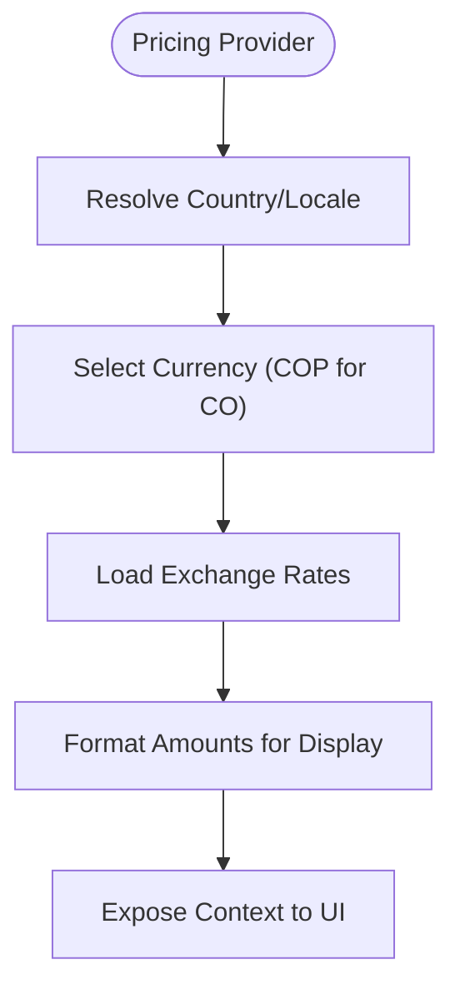

**Diagram sources**
- [src/providers/PricingProvider.tsx:33-58](file://src/providers/PricingProvider.tsx#L33-L58)
- [src/lib/pricing.ts:113-146](file://src/lib/pricing.ts#L113-L146)

**Section sources**
- [src/providers/PricingProvider.tsx:1-63](file://src/providers/PricingProvider.tsx#L1-L63)
- [src/lib/pricing.ts:1-146](file://src/lib/pricing.ts#L1-L146)

### Delivery Estimation: Colombia-Specific Logic
- Delivery estimator computes business-day ranges based on department/city, carrier availability, and cutoff rules.
- Uses canonical department lists and special zones to determine fast/remote/express eligibility.

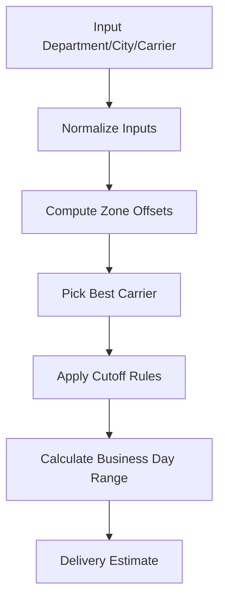

**Diagram sources**
- [src/lib/delivery.ts:443-487](file://src/lib/delivery.ts#L443-L487)

**Section sources**
- [src/lib/delivery.ts:1-488](file://src/lib/delivery.ts#L1-L488)

### Home Page Rendering: Server Components and Data Fetching
- The homepage is a server component that fetches categories and featured products concurrently and passes them to a client component for rendering.

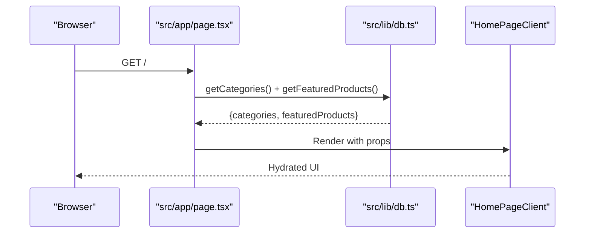

**Diagram sources**
- [src/app/page.tsx:13-25](file://src/app/page.tsx#L13-L25)
- [src/lib/db.ts:113-181](file://src/lib/db.ts#L113-L181)

**Section sources**
- [src/app/page.tsx:1-26](file://src/app/page.tsx#L1-L26)
- [src/lib/db.ts:1-309](file://src/lib/db.ts#L1-L309)

## Dependency Analysis
- Runtime dependencies include Next.js 16, React 19, Tailwind Merge, Framer Motion, and @supabase/supabase-js.
- Dev dependencies include Tailwind CSS v4, TypeScript, ESLint, and Vitest.
- Next.js configuration optimizes imports, configures image hosts, and applies security headers and cache policies.
- Tailwind CSS v4 is wired via PostCSS plugin.

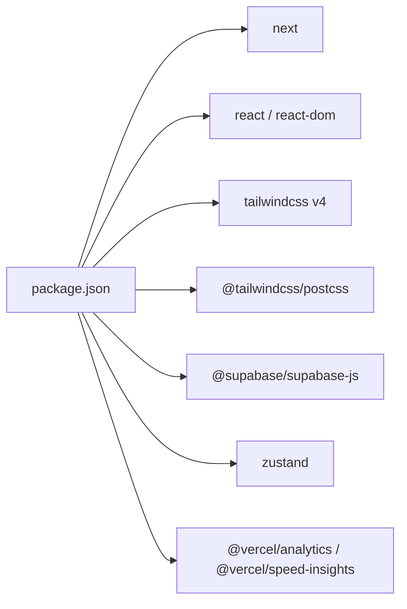

**Diagram sources**
- [package.json:12-39](file://package.json#L12-L39)
- [postcss.config.mjs:1-8](file://postcss.config.mjs#L1-L8)

**Section sources**
- [package.json:1-49](file://package.json#L1-L49)
- [next.config.ts:53-117](file://next.config.ts#L53-L117)
- [postcss.config.mjs:1-8](file://postcss.config.mjs#L1-L8)

## Performance Considerations
- Next.js image optimization with AVIF/WebP formats, remote pattern configuration, and long cache TTLs reduces bandwidth and improves LCP.
- Production cache headers for static assets and images minimize origin requests.
- Zustand store persistence avoids unnecessary re-computation and maintains cart state across sessions.
- Server components enable selective hydration and reduce client-side JavaScript.

[No sources needed since this section provides general guidance]

## Troubleshooting Guide
- Supabase configuration: Ensure NEXT_PUBLIC_SUPABASE_URL and NEXT_PUBLIC_SUPABASE_ANON_KEY are set; otherwise, the client falls back to safe defaults.
- Environment variables: Refer to the README for required and optional environment variables, including Supabase service role key, CSRF secret, SMTP credentials, and admin tokens.
- Delivery estimation: Verify department/city inputs conform to canonical lists; otherwise, the resolver selects Bogotá D.C. as a default.
- Analytics: Telemetry and Pixel are disabled in non-production environments; confirm NODE_ENV and environment variables for tracking.

**Section sources**
- [src/lib/supabase.ts:7-12](file://src/lib/supabase.ts#L7-L12)
- [README.md:10-61](file://README.md#L10-L61)
- [src/lib/delivery.ts:421-436](file://src/lib/delivery.ts#L421-L436)
- [src/components/Telemetry.tsx:12-18](file://src/components/Telemetry.tsx#L12-L18)
- [src/components/FacebookPixel.tsx:34-38](file://src/components/FacebookPixel.tsx#L34-L38)

## Conclusion
AllShop leverages a modern, production-ready stack optimized for the Colombian market: Next.js 16 for a fast, SEO-friendly frontend; Supabase/PostgreSQL for reliable data and auth; custom RPC functions for transaction-safe stock operations; Zustand for efficient client-side state; and Vercel Analytics/Speed Insights plus Facebook Pixel for insights and conversions. The architecture emphasizes correctness (server-side recalculations, RLS, RPC stock ops), scalability (image optimization, caching, modular providers), and localization (fixed Spanish Colombia locale with robust formatting). These choices collectively support a smooth customer experience and streamlined operations in Colombia’s e-commerce landscape.