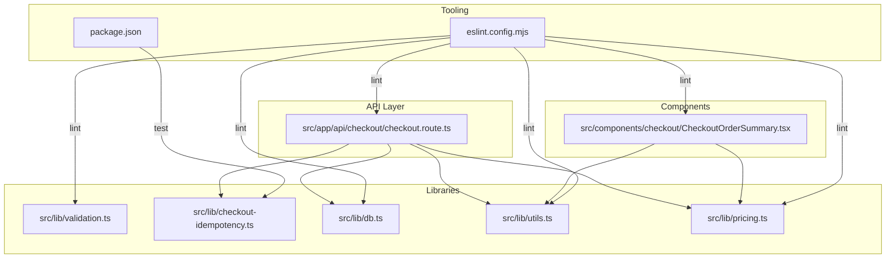
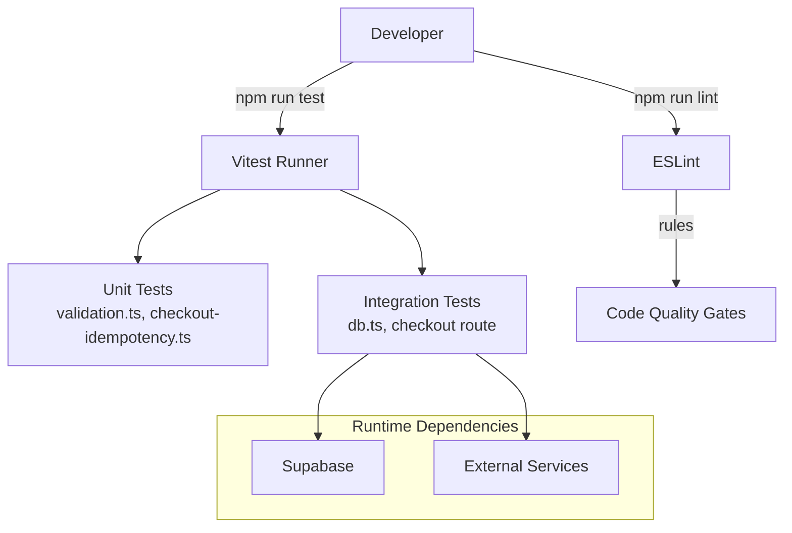
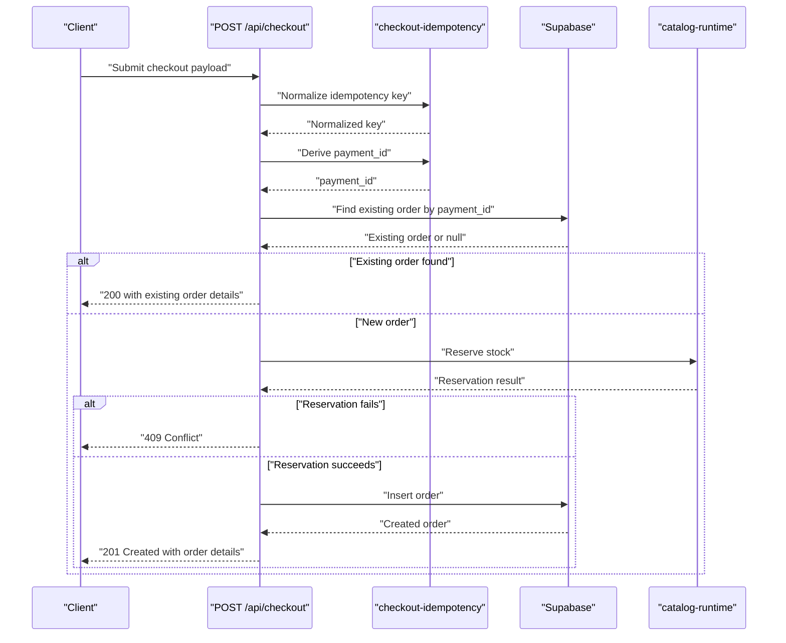
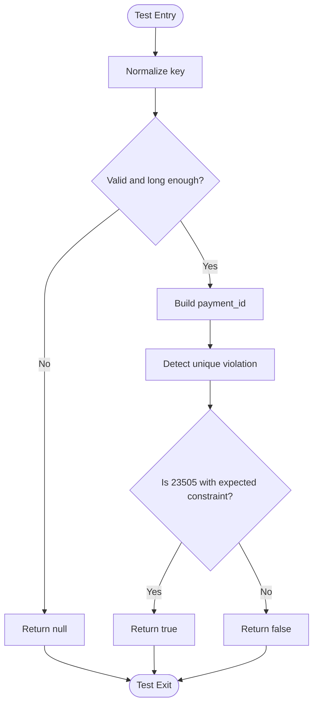
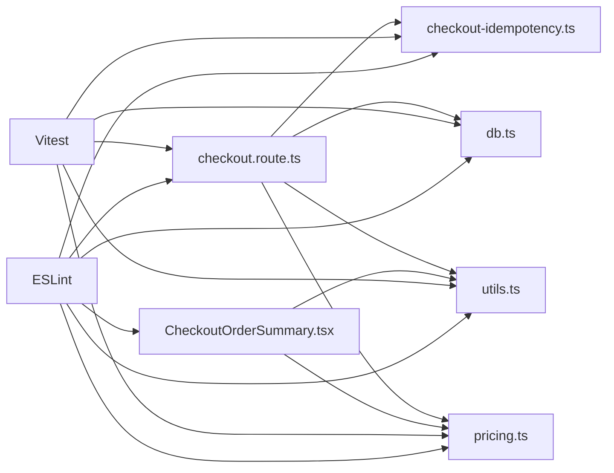

# Testing Strategy

<cite>
**Referenced Files in This Document**
- [package.json](file://package.json)
- [eslint.config.mjs](file://eslint.config.mjs)
- [README.md](file://README.md)
- [src/lib/checkout-idempotency.ts](file://src/lib/checkout-idempotency.ts)
- [src/lib/checkout-idempotency.test.ts](file://src/lib/checkout-idempotency.test.ts)
- [src/lib/validation.ts](file://src/lib/validation.ts)
- [src/lib/db.ts](file://src/lib/db.ts)
- [src/lib/utils.ts](file://src/lib/utils.ts)
- [src/lib/pricing.ts](file://src/lib/pricing.ts)
- [src/app/api/checkout/checkout.route.ts](file://src/app/api/checkout/checkout.route.ts)
- [src/components/checkout/CheckoutOrderSummary.tsx](file://src/components/checkout/CheckoutOrderSummary.tsx)
</cite>

## Table of Contents
1. [Introduction](#introduction)
2. [Project Structure](#project-structure)
3. [Core Components](#core-components)
4. [Architecture Overview](#architecture-overview)
5. [Detailed Component Analysis](#detailed-component-analysis)
6. [Dependency Analysis](#dependency-analysis)
7. [Performance Considerations](#performance-considerations)
8. [Troubleshooting Guide](#troubleshooting-guide)
9. [Conclusion](#conclusion)
10. [Appendices](#appendices)

## Introduction
This document describes AllShop’s testing approach and quality assurance practices. It covers unit testing strategies, component testing methodologies, and API testing procedures. It also documents the testing framework setup, test coverage expectations, continuous integration practices, and how testing integrates with development workflows and quality gates. Special emphasis is placed on checkout idempotency testing, validation testing, and integration testing with external services such as databases and third-party APIs. Guidance is included for database testing, API contract testing, and performance regression testing, along with integration with ESLint for code quality and automated linting.

## Project Structure
AllShop is a Next.js application with a clear separation of concerns:
- API routes under src/app/api handle HTTP endpoints.
- Libraries under src/lib encapsulate reusable business logic, utilities, and integrations.
- Components under src/components implement UI logic and presentation.
- Tests are colocated alongside the code they validate (e.g., checkout-idempotency.test.ts).

**Diagram sources**
- [src/app/api/checkout/checkout.route.ts](file://src/app/api/checkout/checkout.route.ts)
- [src/lib/validation.ts](file://src/lib/validation.ts)
- [src/lib/checkout-idempotency.ts](file://src/lib/checkout-idempotency.ts)
- [src/lib/db.ts](file://src/lib/db.ts)
- [src/lib/utils.ts](file://src/lib/utils.ts)
- [src/lib/pricing.ts](file://src/lib/pricing.ts)
- [src/components/checkout/CheckoutOrderSummary.tsx](file://src/components/checkout/CheckoutOrderSummary.tsx)
- [package.json](file://package.json)
- [eslint.config.mjs](file://eslint.config.mjs)

**Section sources**
- [package.json](file://package.json)
- [eslint.config.mjs](file://eslint.config.mjs)
- [README.md](file://README.md)

## Core Components
- Unit tests: Colocated with the code they validate, using Vitest for execution.
- Validation utilities: Provide field-level validation with user-friendly error messages.
- Idempotency helpers: Normalize keys, derive payment identifiers, and detect unique violations.
- Database abstraction: Centralizes reads/writes to Supabase with fallbacks and normalization.
- Utilities: IP extraction, UUID validation, HTML escaping, and formatting helpers.
- Pricing context: Country/locale/currency resolution and formatting.
- API route: Orchestrates checkout flow, validations, rate limiting, stock reservation, and persistence.

**Section sources**
- [src/lib/validation.ts](file://src/lib/validation.ts)
- [src/lib/checkout-idempotency.ts](file://src/lib/checkout-idempotency.ts)
- [src/lib/db.ts](file://src/lib/db.ts)
- [src/lib/utils.ts](file://src/lib/utils.ts)
- [src/lib/pricing.ts](file://src/lib/pricing.ts)
- [src/app/api/checkout/checkout.route.ts](file://src/app/api/checkout/checkout.route.ts)

## Architecture Overview
The testing architecture leverages:
- Vitest for unit and integration tests.
- ESLint for code quality and automated linting.
- Collocated tests for fast feedback and maintainability.
- API route tests validating end-to-end checkout behavior, including idempotency and error handling.

**Diagram sources**
- [package.json](file://package.json)
- [eslint.config.mjs](file://eslint.config.mjs)
- [src/lib/validation.ts](file://src/lib/validation.ts)
- [src/lib/checkout-idempotency.ts](file://src/lib/checkout-idempotency.ts)
- [src/lib/db.ts](file://src/lib/db.ts)
- [src/app/api/checkout/checkout.route.ts](file://src/app/api/checkout/checkout.route.ts)

## Detailed Component Analysis

### Unit Testing Strategies
- Test colocated with implementation for quick feedback and reduced cognitive load.
- Use descriptive test suites and assertions to validate behavior boundaries.
- Mock external dependencies where appropriate (e.g., database calls) to isolate units.

Examples of unit-tested modules:
- Validation utilities: Field validators and aggregated validation.
- Idempotency helpers: Key normalization, payment ID mapping, and unique violation detection.
- Utilities: IP extraction, UUID validation, and HTML escaping.
- Pricing context: Currency resolution and formatting.

**Section sources**
- [src/lib/validation.ts](file://src/lib/validation.ts)
- [src/lib/checkout-idempotency.ts](file://src/lib/checkout-idempotency.ts)
- [src/lib/utils.ts](file://src/lib/utils.ts)
- [src/lib/pricing.ts](file://src/lib/pricing.ts)

### Component Testing Methodologies
- UI components are client-rendered and rely on shared utilities and providers.
- Component tests should verify rendering, event handling, and integration with shared utilities.
- Example: CheckoutOrderSummary validates order summary rendering, quantity updates, removal, and checkout button behavior.

Recommended testing pattern:
- Render the component with minimal props.
- Simulate user interactions (clicks, updates).
- Assert DOM changes and emitted callbacks.
- Verify integration with shared utilities (formatting, image paths).

**Section sources**
- [src/components/checkout/CheckoutOrderSummary.tsx](file://src/components/checkout/CheckoutOrderSummary.tsx)
- [src/lib/utils.ts](file://src/lib/utils.ts)
- [src/lib/pricing.ts](file://src/lib/pricing.ts)

### API Testing Procedures
- API route tests should validate:
  - Request parsing and normalization.
  - Authorization and CSRF checks.
  - Rate limiting behavior.
  - Stock reservation and restoration.
  - Idempotency handling and duplicate order detection.
  - Persistence and error responses.
- Contract tests should assert response shape, status codes, and headers.

Checkout API testing highlights:
- Idempotency key normalization and payment ID derivation.
- Duplicate payment ID detection and existing order replay.
- Stock reservation and rollback on failure.
- Anti-VPN/IP blocking checks.
- Rate limiting and anti-fraud safeguards.

**Diagram sources**
- [src/app/api/checkout/checkout.route.ts](file://src/app/api/checkout/checkout.route.ts)
- [src/lib/checkout-idempotency.ts](file://src/lib/checkout-idempotency.ts)

**Section sources**
- [src/app/api/checkout/checkout.route.ts](file://src/app/api/checkout/checkout.route.ts)
- [src/lib/checkout-idempotency.ts](file://src/lib/checkout-idempotency.ts)

### Checkout Idempotency Testing
- Normalize idempotency keys and reject invalid inputs.
- Map normalized keys to payment IDs.
- Detect unique violations for payment_id index.
- Replay existing order when a duplicate payment ID is encountered.

**Diagram sources**
- [src/lib/checkout-idempotency.test.ts](file://src/lib/checkout-idempotency.test.ts)
- [src/lib/checkout-idempotency.ts](file://src/lib/checkout-idempotency.ts)

**Section sources**
- [src/lib/checkout-idempotency.test.ts](file://src/lib/checkout-idempotency.test.ts)
- [src/lib/checkout-idempotency.ts](file://src/lib/checkout-idempotency.ts)

### Validation Testing
- Validate each field independently with clear error messages.
- Aggregate validation across all fields.
- Ensure consistent trimming and sanitization.

Testing approach:
- Provide valid inputs and assert no errors.
- Provide invalid inputs and assert expected error messages.
- Test boundary conditions (min/max lengths, digit counts).

**Section sources**
- [src/lib/validation.ts](file://src/lib/validation.ts)

### Database Testing
- Abstract database operations behind a single module to simplify mocking and testing.
- Use mocks to simulate database responses and errors.
- Validate normalization and deduplication logic for products and categories.
- Ensure fallback behavior when database is not configured.

Recommended patterns:
- Replace database calls with in-memory fixtures for unit tests.
- Mock error responses to validate error handling paths.
- Test slug normalization and lookup candidates.

**Section sources**
- [src/lib/db.ts](file://src/lib/db.ts)

### Integration Testing with External Services
- API route tests should validate integration with:
  - Supabase for product queries and order persistence.
  - External services for notifications and logistics.
- Use environment-aware logic to conditionally enable features and assert error responses when services are misconfigured.

**Section sources**
- [src/app/api/checkout/checkout.route.ts](file://src/app/api/checkout/checkout.route.ts)
- [src/lib/db.ts](file://src/lib/db.ts)

### Continuous Integration Practices
- Automated linting and testing are integrated into the development workflow via npm scripts.
- CI should run linting and tests on pull requests and push to main.
- Quality gates: build must pass linting and tests before merging.

**Section sources**
- [package.json](file://package.json)
- [eslint.config.mjs](file://eslint.config.mjs)
- [README.md](file://README.md)

## Dependency Analysis
Testing dependencies and relationships:
- API route depends on validation, idempotency, database, utilities, and pricing modules.
- Component tests depend on shared utilities and providers.
- Tests rely on Vitest for execution and ESLint for code quality.

**Diagram sources**
- [src/app/api/checkout/checkout.route.ts](file://src/app/api/checkout/checkout.route.ts)
- [src/lib/checkout-idempotency.ts](file://src/lib/checkout-idempotency.ts)
- [src/lib/db.ts](file://src/lib/db.ts)
- [src/lib/utils.ts](file://src/lib/utils.ts)
- [src/lib/pricing.ts](file://src/lib/pricing.ts)
- [src/components/checkout/CheckoutOrderSummary.tsx](file://src/components/checkout/CheckoutOrderSummary.tsx)
- [package.json](file://package.json)
- [eslint.config.mjs](file://eslint.config.mjs)

**Section sources**
- [src/app/api/checkout/checkout.route.ts](file://src/app/api/checkout/checkout.route.ts)
- [src/lib/checkout-idempotency.ts](file://src/lib/checkout-idempotency.ts)
- [src/lib/db.ts](file://src/lib/db.ts)
- [src/lib/utils.ts](file://src/lib/utils.ts)
- [src/lib/pricing.ts](file://src/lib/pricing.ts)
- [src/components/checkout/CheckoutOrderSummary.tsx](file://src/components/checkout/CheckoutOrderSummary.tsx)
- [package.json](file://package.json)
- [eslint.config.mjs](file://eslint.config.mjs)

## Performance Considerations
- Prefer mocking external services in unit tests to avoid flaky and slow tests.
- Use deterministic inputs and controlled environments to ensure reproducible results.
- Validate performance regressions by measuring test execution time and adding targeted benchmarks where appropriate.
- Keep tests focused and fast; avoid heavy setup in unit tests.

## Troubleshooting Guide
Common testing challenges and resolutions:
- Database testing
  - Use in-memory fixtures or mocks to simulate database responses.
  - Validate error handling paths by injecting error responses.
- API contract testing
  - Define expected response shapes and status codes.
  - Assert headers and body content for critical endpoints.
- Performance regression testing
  - Track test execution duration and alert on regressions.
  - Use targeted benchmarks for hot-path functions.
- ESLint integration
  - Run linting locally and in CI to enforce style and correctness.
  - Fix lint errors before running tests to avoid noise.

**Section sources**
- [eslint.config.mjs](file://eslint.config.mjs)
- [package.json](file://package.json)

## Conclusion
AllShop’s testing strategy emphasizes colocated unit tests, robust validation and idempotency logic, and clear integration boundaries. By leveraging Vitest and ESLint, the project ensures fast feedback loops, consistent code quality, and reliable behavior across API routes, libraries, and components. Extending tests to cover database interactions and external service integrations will further strengthen confidence in the system.

## Appendices

### Practical Examples: Test Implementation Patterns
- Unit tests for validation utilities: Provide valid and invalid inputs to field validators and assert expected outcomes.
- Unit tests for idempotency helpers: Normalize keys, map to payment IDs, and detect unique violations.
- Component tests for CheckoutOrderSummary: Render with sample cart items, simulate quantity updates and removals, and verify UI state.
- API tests for checkout route: Validate request parsing, CSRF and rate limiting, stock reservation, idempotency replay, and error responses.

**Section sources**
- [src/lib/validation.ts](file://src/lib/validation.ts)
- [src/lib/checkout-idempotency.test.ts](file://src/lib/checkout-idempotency.test.ts)
- [src/components/checkout/CheckoutOrderSummary.tsx](file://src/components/checkout/CheckoutOrderSummary.tsx)
- [src/app/api/checkout/checkout.route.ts](file://src/app/api/checkout/checkout.route.ts)