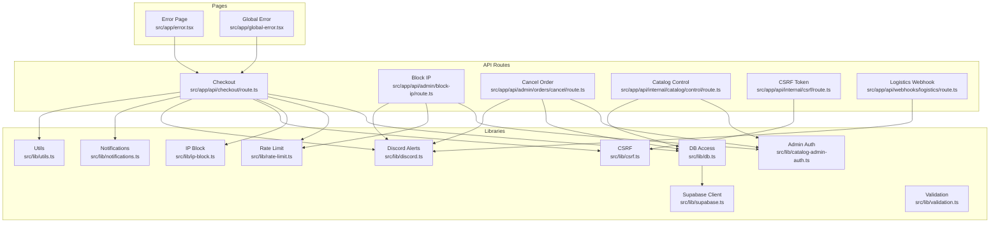
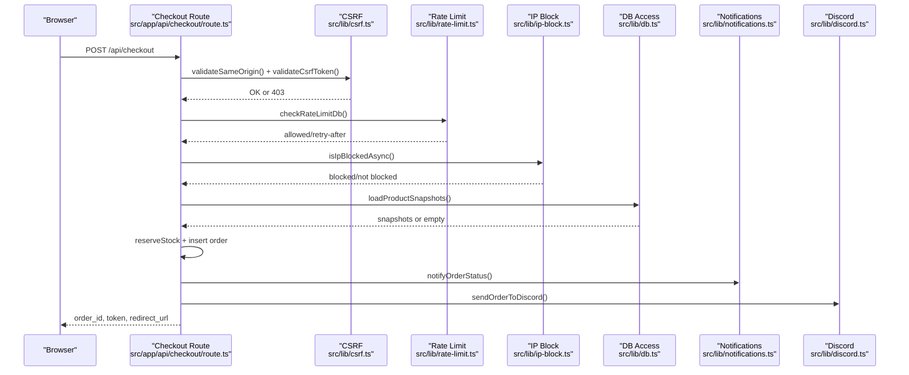
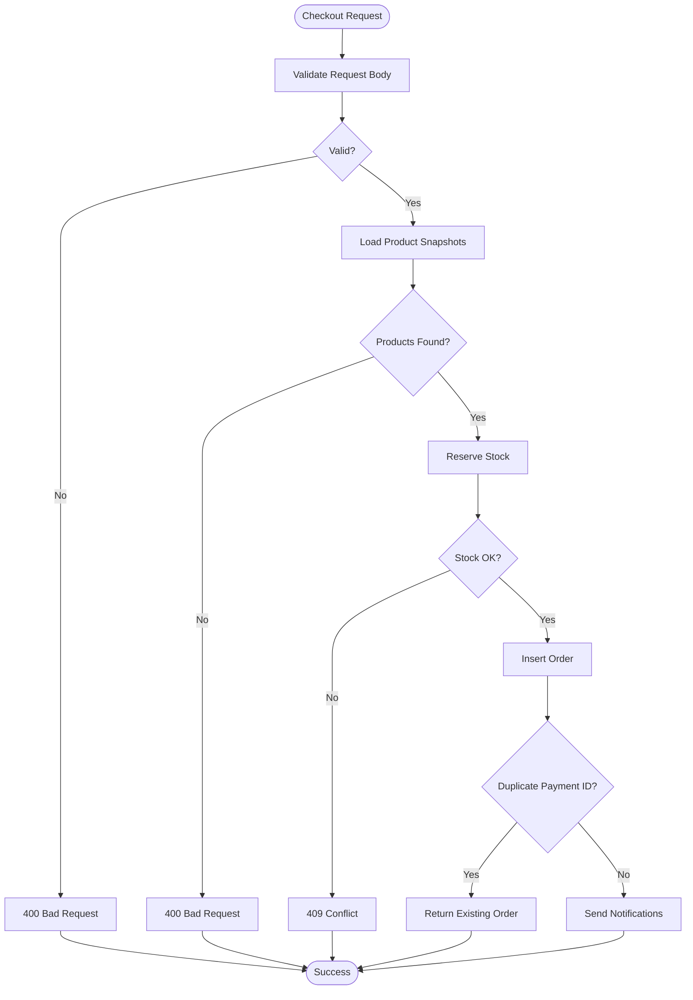
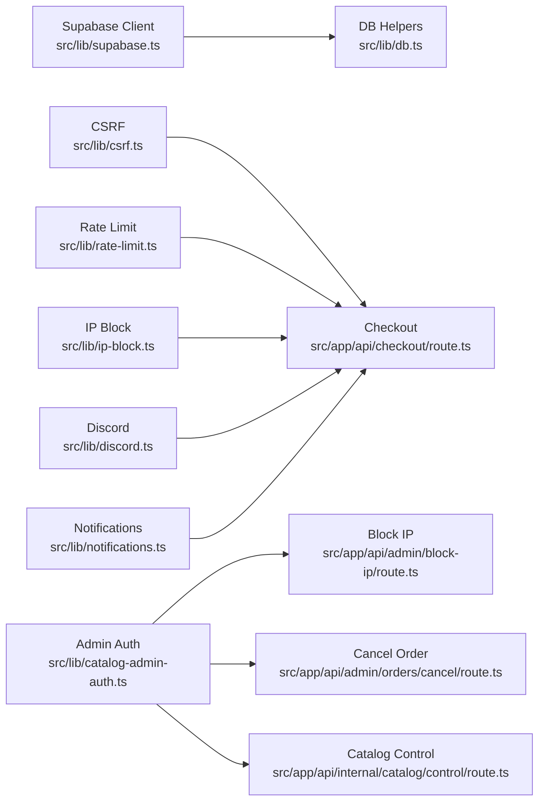

# Troubleshooting & FAQ

<cite>
**Referenced Files in This Document**
- [src/app/error.tsx](file://src/app/error.tsx)
- [src/app/global-error.tsx](file://src/app/global-error.tsx)
- [src/lib/db.ts](file://src/lib/db.ts)
- [src/lib/supabase.ts](file://src/lib/supabase.ts)
- [src/lib/validation.ts](file://src/lib/validation.ts)
- [src/lib/catalog-admin-auth.ts](file://src/lib/catalog-admin-auth.ts)
- [src/app/api/admin/block-ip/route.ts](file://src/app/api/admin/block-ip/route.ts)
- [src/app/api/admin/orders/cancel/route.ts](file://src/app/api/admin/orders/cancel/route.ts)
- [src/app/api/checkout/route.ts](file://src/app/api/checkout/route.ts)
- [src/app/api/internal/catalog/control/route.ts](file://src/app/api/internal/catalog/control/route.ts)
- [src/app/api/internal/csrf/route.ts](file://src/app/api/internal/csrf/route.ts)
- [src/app/api/webhooks/logistics/route.ts](file://src/app/api/webhooks/logistics/route.ts)
- [src/lib/discord.ts](file://src/lib/discord.ts)
- [src/lib/notifications.ts](file://src/lib/notifications.ts)
- [src/lib/rate-limit.ts](file://src/lib/rate-limit.ts)
- [src/lib/ip-block.ts](file://src/lib/ip-block.ts)
- [src/lib/utils.ts](file://src/lib/utils.ts)
- [src/lib/csrf.ts](file://src/lib/csrf.ts)
</cite>

## Table of Contents
1. [Introduction](#introduction)
2. [Project Structure](#project-structure)
3. [Core Components](#core-components)
4. [Architecture Overview](#architecture-overview)
5. [Detailed Component Analysis](#detailed-component-analysis)
6. [Dependency Analysis](#dependency-analysis)
7. [Performance Considerations](#performance-considerations)
8. [Troubleshooting Guide](#troubleshooting-guide)
9. [Conclusion](#conclusion)
10. [Appendices](#appendices)

## Introduction
This document provides a comprehensive troubleshooting guide and FAQ for the ecommerce platform. It focuses on diagnosing and resolving common issues around database connectivity, API endpoint failures, checkout process problems, and admin panel access. It also documents error handling patterns, logging strategies, debugging techniques, validation failures, integration issues, monitoring integrations, and support workflows. Practical examples illustrate problem diagnosis, resolution steps, and preventive measures.

## Project Structure
The application follows a Next.js App Router structure with a clear separation of client-side pages, API routes, shared libraries, and UI components. Key areas relevant to troubleshooting include:
- API routes under src/app/api for checkout, admin actions, internal controls, and webhooks
- Shared libraries under src/lib for database access, validation, rate limiting, IP blocking, CSRF, and notifications
- Error boundary pages under src/app for user-facing and global error handling

**Diagram sources**
- [src/app/error.tsx:1-57](file://src/app/error.tsx#L1-L57)
- [src/app/global-error.tsx:1-56](file://src/app/global-error.tsx#L1-L56)
- [src/app/api/checkout/route.ts:1-872](file://src/app/api/checkout/route.ts#L1-L872)
- [src/app/api/admin/block-ip/route.ts:1-140](file://src/app/api/admin/block-ip/route.ts#L1-L140)
- [src/app/api/admin/orders/cancel/route.ts:1-237](file://src/app/api/admin/orders/cancel/route.ts#L1-L237)
- [src/app/api/internal/catalog/control/route.ts:1-191](file://src/app/api/internal/catalog/control/route.ts#L1-L191)
- [src/app/api/internal/csrf/route.ts:1-35](file://src/app/api/internal/csrf/route.ts#L1-L35)
- [src/app/api/webhooks/logistics/route.ts:1-19](file://src/app/api/webhooks/logistics/route.ts#L1-L19)
- [src/lib/db.ts:1-309](file://src/lib/db.ts#L1-L309)
- [src/lib/supabase.ts:1-20](file://src/lib/supabase.ts#L1-L20)
- [src/lib/validation.ts:1-112](file://src/lib/validation.ts#L1-L112)
- [src/lib/rate-limit.ts:1-165](file://src/lib/rate-limit.ts#L1-L165)
- [src/lib/ip-block.ts:1-210](file://src/lib/ip-block.ts#L1-L210)
- [src/lib/csrf.ts:1-119](file://src/lib/csrf.ts#L1-L119)
- [src/lib/discord.ts:1-379](file://src/lib/discord.ts#L1-L379)
- [src/lib/notifications.ts:1-408](file://src/lib/notifications.ts#L1-L408)
- [src/lib/utils.ts:1-102](file://src/lib/utils.ts#L1-L102)
- [src/lib/catalog-admin-auth.ts:1-65](file://src/lib/catalog-admin-auth.ts#L1-L65)

**Section sources**
- [src/app/error.tsx:1-57](file://src/app/error.tsx#L1-L57)
- [src/app/global-error.tsx:1-56](file://src/app/global-error.tsx#L1-L56)
- [src/lib/db.ts:1-309](file://src/lib/db.ts#L1-L309)
- [src/lib/supabase.ts:1-20](file://src/lib/supabase.ts#L1-L20)
- [src/lib/validation.ts:1-112](file://src/lib/validation.ts#L1-L112)
- [src/lib/rate-limit.ts:1-165](file://src/lib/rate-limit.ts#L1-L165)
- [src/lib/ip-block.ts:1-210](file://src/lib/ip-block.ts#L1-L210)
- [src/lib/csrf.ts:1-119](file://src/lib/csrf.ts#L1-L119)
- [src/lib/discord.ts:1-379](file://src/lib/discord.ts#L1-L379)
- [src/lib/notifications.ts:1-408](file://src/lib/notifications.ts#L1-L408)
- [src/lib/utils.ts:1-102](file://src/lib/utils.ts#L1-L102)
- [src/lib/catalog-admin-auth.ts:1-65](file://src/lib/catalog-admin-auth.ts#L1-L65)

## Core Components
- Error boundaries and user-facing error pages:
  - Runtime error page captures and displays recoverable errors with retry/back navigation.
  - Global error page handles deep server errors with a hard reload option and optional debug digest.
- Database connectivity:
  - Supabase client initialization with environment guardrails and fallbacks.
  - Database access helpers that gracefully degrade to mock data when Supabase is not configured.
- Validation:
  - Checkout form validation utilities with localized, user-friendly messages.
- Admin authentication and access control:
  - Secret-based validation for admin endpoints and catalog control panel.
- Monitoring and notifications:
  - Discord webhooks for order alerts, moderation commands, and cancellation outcomes.
  - Email notifications via Nodemailer with structured templates and fallbacks.
- Rate limiting and IP blocking:
  - In-memory and DB-backed rate limiting for critical paths.
  - IP blocklist with in-memory cache synchronized to Supabase.

**Section sources**
- [src/app/error.tsx:9-56](file://src/app/error.tsx#L9-L56)
- [src/app/global-error.tsx:5-54](file://src/app/global-error.tsx#L5-L54)
- [src/lib/supabase.ts:4-19](file://src/lib/supabase.ts#L4-L19)
- [src/lib/db.ts:113-309](file://src/lib/db.ts#L113-L309)
- [src/lib/validation.ts:14-112](file://src/lib/validation.ts#L14-L112)
- [src/lib/discord.ts:79-228](file://src/lib/discord.ts#L79-L228)
- [src/lib/notifications.ts:89-408](file://src/lib/notifications.ts#L89-L408)
- [src/lib/rate-limit.ts:43-164](file://src/lib/rate-limit.ts#L43-L164)
- [src/lib/ip-block.ts:25-132](file://src/lib/ip-block.ts#L25-L132)

## Architecture Overview
The system integrates client-side pages with serverless API routes. Critical flows include checkout, admin actions, and catalog control, each protected by authentication, rate limiting, and validations. Database operations are guarded by environment configuration checks and fallbacks. Observability is achieved via Discord webhooks and email notifications.

**Diagram sources**
- [src/app/api/checkout/route.ts:497-800](file://src/app/api/checkout/route.ts#L497-L800)
- [src/lib/csrf.ts:91-119](file://src/lib/csrf.ts#L91-L119)
- [src/lib/rate-limit.ts:101-164](file://src/lib/rate-limit.ts#L101-L164)
- [src/lib/ip-block.ts:25-72](file://src/lib/ip-block.ts#L25-L72)
- [src/lib/db.ts:255-352](file://src/lib/db.ts#L255-L352)
- [src/lib/notifications.ts:89-135](file://src/lib/notifications.ts#L89-L135)
- [src/lib/discord.ts:79-228](file://src/lib/discord.ts#L79-L228)

## Detailed Component Analysis

### Database Connectivity Troubleshooting
Common symptoms:
- Empty product/category lists
- Errors when accessing admin endpoints
- Checkout failing due to missing database

Diagnostic steps:
- Verify Supabase client configuration:
  - Ensure NEXT_PUBLIC_SUPABASE_URL and NEXT_PUBLIC_SUPABASE_ANON_KEY are set and not placeholders.
  - Confirm isSupabaseClientConfigured resolves to true.
- Check database availability:
  - Confirm Supabase project is reachable and tables exist (products, categories, orders, blocked_ips, rate_limits).
- Observe fallback behavior:
  - When not configured, database helpers return mock data or empty arrays. This helps isolate whether the issue is configuration or runtime.

Resolution tips:
- Set correct environment variables for the deployment environment.
- Validate database connection via Supabase dashboard and test queries.
- Temporarily enable local development fallbacks only for testing.

**Section sources**
- [src/lib/supabase.ts:4-19](file://src/lib/supabase.ts#L4-L19)
- [src/lib/db.ts:113-123](file://src/lib/db.ts#L113-L123)
- [src/lib/db.ts:183-224](file://src/lib/db.ts#L183-L224)

### API Endpoint Failures
Symptoms:
- 401/403 unauthorized responses from admin endpoints
- 400/409 malformed or conflicting requests
- 429 rate limit exceeded
- 500 internal server errors

Root causes and fixes:
- Admin endpoints require a valid bearer token:
  - Ensure ADMIN_BLOCK_SECRET or ORDER_LOOKUP_SECRET is set and matches the Authorization header.
  - Verify the token is correctly formatted and not expired.
- Checkout requires CSRF and same-origin protection:
  - Obtain a CSRF token from the internal CSRF endpoint.
  - Ensure requests originate from the same host (Origin/Referer).
- Rate limiting:
  - Respect Retry-After headers and reduce request frequency.
  - For critical paths, DB-backed rate limits are used; ensure Supabase is configured.
- Duplicate order prevention:
  - Use idempotency keys to avoid duplicate inserts; the system returns existing order details when a matching payment_id exists.

**Section sources**
- [src/app/api/admin/block-ip/route.ts:24-41](file://src/app/api/admin/block-ip/route.ts#L24-L41)
- [src/app/api/admin/orders/cancel/route.ts:48-65](file://src/app/api/admin/orders/cancel/route.ts#L48-L65)
- [src/app/api/checkout/route.ts:505-531](file://src/app/api/checkout/route.ts#L505-L531)
- [src/app/api/internal/csrf/route.ts:6-15](file://src/app/api/internal/csrf/route.ts#L6-L15)
- [src/lib/rate-limit.ts:101-164](file://src/lib/rate-limit.ts#L101-L164)
- [src/app/api/checkout/route.ts:643-661](file://src/app/api/checkout/route.ts#L643-L661)

### Checkout Process Issues
Symptoms:
- Validation errors on form submission
- Stock reservation failures
- Shipping cost mismatches
- Duplicate order creation attempts

Diagnostic flow:
- Form validation:
  - Name, email, phone, document, address, city, and department must meet strict criteria.
  - Verification flags (address_confirmed, availability_confirmed, product_acknowledged) must be true.
- Product resolution:
  - Products must be active and resolvable by id or slug.
  - Free shipping and custom shipping costs are considered; mismatches are logged.
- Stock reservation:
  - If stock is insufficient, the system returns a 409 Conflict and restores reservations.
- Order insertion:
  - On duplicate payment_id, returns existing order details instead of creating duplicates.

**Diagram sources**
- [src/app/api/checkout/route.ts:596-621](file://src/app/api/checkout/route.ts#L596-L621)
- [src/app/api/checkout/route.ts:663-685](file://src/app/api/checkout/route.ts#L663-L685)
- [src/app/api/checkout/route.ts:759-795](file://src/app/api/checkout/route.ts#L759-L795)

**Section sources**
- [src/lib/validation.ts:14-112](file://src/lib/validation.ts#L14-L112)
- [src/app/api/checkout/route.ts:596-621](file://src/app/api/checkout/route.ts#L596-L621)
- [src/app/api/checkout/route.ts:663-685](file://src/app/api/checkout/route.ts#L663-L685)
- [src/app/api/checkout/route.ts:759-795](file://src/app/api/checkout/route.ts#L759-L795)

### Admin Panel Access Problems
Symptoms:
- 401 Unauthorized when accessing catalog control
- 500 Internal Server Error due to missing secrets
- Incorrect responses when updating product stock/price

Diagnostic steps:
- Verify CATALOG_ADMIN_ACCESS_CODE is set and meets minimum length.
- Ensure the request includes the correct header x-catalog-admin-code.
- For PATCH updates, validate numeric fields and slug presence.

Resolution:
- Set CATALOG_ADMIN_ACCESS_CODE in environment variables.
- Use the correct code in the x-catalog-admin-code header.
- Ensure the slug is provided and numeric fields are integers ≥ 0.

**Section sources**
- [src/app/api/internal/catalog/control/route.ts:59-79](file://src/app/api/internal/catalog/control/route.ts#L59-L79)
- [src/app/api/internal/catalog/control/route.ts:128-133](file://src/app/api/internal/catalog/control/route.ts#L128-L133)
- [src/lib/catalog-admin-auth.ts:33-35](file://src/lib/catalog-admin-auth.ts#L33-L35)

### Monitoring, Logging, and Debugging
- Console logs:
  - Checkout route logs warnings for shipping cost mismatches.
  - Admin endpoints log errors during catalog control operations.
- Discord webhooks:
  - Order alerts include moderation commands and admin actions.
  - Cancellation outcomes are posted with color-coded embeds.
- Email notifications:
  - Order status updates are sent via Nodemailer with structured HTML and text bodies.
- Error boundaries:
  - Runtime errors show a friendly retry/back UI.
  - Global errors provide a hard reload and optional debug digest.

**Section sources**
- [src/app/api/checkout/route.ts:712-718](file://src/app/api/checkout/route.ts#L712-L718)
- [src/app/api/internal/catalog/control/route.ts:92-103](file://src/app/api/internal/catalog/control/route.ts#L92-L103)
- [src/lib/discord.ts:79-228](file://src/lib/discord.ts#L79-L228)
- [src/lib/discord.ts:271-315](file://src/lib/discord.ts#L271-L315)
- [src/lib/notifications.ts:383-408](file://src/lib/notifications.ts#L383-L408)
- [src/app/error.tsx:18-20](file://src/app/error.tsx#L18-L20)
- [src/app/global-error.tsx:43-49](file://src/app/global-error.tsx#L43-L49)

## Dependency Analysis
Key dependencies and their roles:
- Supabase client and database access helpers
- CSRF and same-origin validators
- Rate limiting (memory and DB-backed)
- IP blocking with in-memory cache and DB persistence
- Discord and email notification integrations

**Diagram sources**
- [src/lib/supabase.ts:1-20](file://src/lib/supabase.ts#L1-L20)
- [src/lib/db.ts:1-309](file://src/lib/db.ts#L1-L309)
- [src/lib/csrf.ts:1-119](file://src/lib/csrf.ts#L1-L119)
- [src/lib/rate-limit.ts:1-165](file://src/lib/rate-limit.ts#L1-L165)
- [src/lib/ip-block.ts:1-210](file://src/lib/ip-block.ts#L1-L210)
- [src/lib/discord.ts:1-379](file://src/lib/discord.ts#L1-L379)
- [src/lib/notifications.ts:1-408](file://src/lib/notifications.ts#L1-L408)
- [src/lib/catalog-admin-auth.ts:1-65](file://src/lib/catalog-admin-auth.ts#L1-L65)
- [src/app/api/checkout/route.ts:1-872](file://src/app/api/checkout/route.ts#L1-L872)
- [src/app/api/admin/block-ip/route.ts:1-140](file://src/app/api/admin/block-ip/route.ts#L1-L140)
- [src/app/api/admin/orders/cancel/route.ts:1-237](file://src/app/api/admin/orders/cancel/route.ts#L1-L237)
- [src/app/api/internal/catalog/control/route.ts:1-191](file://src/app/api/internal/catalog/control/route.ts#L1-L191)

**Section sources**
- [src/lib/supabase.ts:1-20](file://src/lib/supabase.ts#L1-L20)
- [src/lib/db.ts:1-309](file://src/lib/db.ts#L1-L309)
- [src/lib/csrf.ts:1-119](file://src/lib/csrf.ts#L1-L119)
- [src/lib/rate-limit.ts:1-165](file://src/lib/rate-limit.ts#L1-L165)
- [src/lib/ip-block.ts:1-210](file://src/lib/ip-block.ts#L1-L210)
- [src/lib/discord.ts:1-379](file://src/lib/discord.ts#L1-L379)
- [src/lib/notifications.ts:1-408](file://src/lib/notifications.ts#L1-L408)
- [src/lib/catalog-admin-auth.ts:1-65](file://src/lib/catalog-admin-auth.ts#L1-L65)
- [src/app/api/checkout/route.ts:1-872](file://src/app/api/checkout/route.ts#L1-L872)
- [src/app/api/admin/block-ip/route.ts:1-140](file://src/app/api/admin/block-ip/route.ts#L1-L140)
- [src/app/api/admin/orders/cancel/route.ts:1-237](file://src/app/api/admin/orders/cancel/route.ts#L1-L237)
- [src/app/api/internal/catalog/control/route.ts:1-191](file://src/app/api/internal/catalog/control/route.ts#L1-L191)

## Performance Considerations
- Rate limiting:
  - In-memory bucketing provides fast-path checks; DB-backed limits are used for critical paths.
  - Cleanup of expired buckets keeps memory footprint manageable.
- IP blocking:
  - Memory cache accelerates lookups; DB verification ensures cross-instance enforcement.
- Product resolution:
  - Parallel queries for id and slug reduce latency.
- Email and Discord:
  - Asynchronous sends prevent blocking the main request path.

[No sources needed since this section provides general guidance]

## Troubleshooting Guide

### Database Connectivity Problems
- Symptoms: Products/categories not loading, admin endpoints fail, checkout errors.
- Steps:
  - Confirm NEXT_PUBLIC_SUPABASE_URL and NEXT_PUBLIC_SUPABASE_ANON_KEY are set and valid.
  - Check Supabase dashboard for connectivity and table existence.
  - Review fallback behavior: when not configured, mock data is returned.
- Resolution:
  - Set correct environment variables.
  - Fix database configuration and permissions.

**Section sources**
- [src/lib/supabase.ts:4-12](file://src/lib/supabase.ts#L4-L12)
- [src/lib/db.ts:113-123](file://src/lib/db.ts#L113-L123)

### API Endpoint Failures
- Admin block IP:
  - Ensure ADMIN_BLOCK_SECRET or ORDER_LOOKUP_SECRET is set and Authorization header matches.
  - Validate IP format and duration values.
- Admin cancel order:
  - Verify Supabase admin client is configured.
  - Ensure order_id is a valid UUID and order exists.
- CSRF and same-origin:
  - Obtain CSRF token from internal endpoint.
  - Ensure Origin/Referer matches the host in production.

**Section sources**
- [src/app/api/admin/block-ip/route.ts:24-41](file://src/app/api/admin/block-ip/route.ts#L24-L41)
- [src/app/api/admin/orders/cancel/route.ts:48-65](file://src/app/api/admin/orders/cancel/route.ts#L48-L65)
- [src/app/api/checkout/route.ts:505-531](file://src/app/api/checkout/route.ts#L505-L531)
- [src/app/api/internal/csrf/route.ts:6-15](file://src/app/api/internal/csrf/route.ts#L6-L15)

### Checkout Process Issues
- Validation failures:
  - Check name, email, phone, document, address, city, department, and verification flags.
- Stock reservation:
  - Insufficient stock leads to 409; verify product availability and quantities.
- Duplicate orders:
  - Use idempotency keys; the system returns existing order details.

**Section sources**
- [src/lib/validation.ts:14-112](file://src/lib/validation.ts#L14-L112)
- [src/app/api/checkout/route.ts:663-685](file://src/app/api/checkout/route.ts#L663-L685)
- [src/app/api/checkout/route.ts:643-661](file://src/app/api/checkout/route.ts#L643-L661)

### Admin Panel Access Problems
- Access denied:
  - Set CATALOG_ADMIN_ACCESS_CODE and include x-catalog-admin-code header.
- Update failures:
  - Ensure slug is provided and numeric fields are integers ≥ 0.

**Section sources**
- [src/lib/catalog-admin-auth.ts:33-35](file://src/lib/catalog-admin-auth.ts#L33-L35)
- [src/app/api/internal/catalog/control/route.ts:128-133](file://src/app/api/internal/catalog/control/route.ts#L128-L133)

### Monitoring and Error Reporting
- Use Discord webhooks for order alerts and moderation commands.
- Enable email notifications by configuring SMTP credentials.
- Check console logs for warnings and errors during checkout and admin operations.

**Section sources**
- [src/lib/discord.ts:79-228](file://src/lib/discord.ts#L79-L228)
- [src/lib/notifications.ts:31-41](file://src/lib/notifications.ts#L31-L41)
- [src/app/api/checkout/route.ts:712-718](file://src/app/api/checkout/route.ts#L712-L718)

### Support Workflows
- Global error page provides a hard reload and optional debug digest for deep server errors.
- Error page offers retry/back navigation for runtime errors.

**Section sources**
- [src/app/global-error.tsx:5-54](file://src/app/global-error.tsx#L5-L54)
- [src/app/error.tsx:9-56](file://src/app/error.tsx#L9-L56)

## Conclusion
This guide consolidates actionable diagnostics and resolutions for common operational issues. By validating environment configuration, enforcing authentication and rate limits, and leveraging built-in monitoring channels, teams can quickly identify and resolve problems while maintaining a resilient and observable system.

[No sources needed since this section summarizes without analyzing specific files]

## Appendices

### Frequently Asked Questions

Q: How do I fix “Supabase not configured” errors?
- Ensure NEXT_PUBLIC_SUPABASE_URL and NEXT_PUBLIC_SUPABASE_ANON_KEY are set and not placeholder values. Verify database connectivity and table existence.

Q: Why does checkout return 400/409?
- 400 indicates invalid or incomplete request data; verify form validation rules and verification flags.
- 409 indicates stock conflicts; adjust quantities or wait for stock restoration.

Q: How do I access the admin panel?
- Set CATALOG_ADMIN_ACCESS_CODE and include x-catalog-admin-code header when calling the catalog control endpoint.

Q: Why am I getting rate limit errors?
- Respect Retry-After headers and reduce request volume. For critical paths, ensure DB-backed rate limits are enabled.

Q: How do I configure email notifications?
- Set SMTP_USER and SMTP_PASSWORD to enable order status emails.

Q: How do I block an IP via admin API?
- Use the block-ip endpoint with a valid bearer token and proper IP/duration parameters.

Q: How do I cancel an order via admin API?
- Use the cancel endpoint with a valid bearer token and a valid order_id.

Q: How do I generate a CSRF token?
- Call the internal CSRF endpoint to obtain a token for production use.

Q: Why is the logistics webhook disabled?
- The logistics webhook is intentionally disabled for manual dispatch operations.

**Section sources**
- [src/lib/supabase.ts:4-12](file://src/lib/supabase.ts#L4-L12)
- [src/lib/validation.ts:14-112](file://src/lib/validation.ts#L14-L112)
- [src/app/api/checkout/route.ts:643-661](file://src/app/api/checkout/route.ts#L643-L661)
- [src/app/api/internal/catalog/control/route.ts:59-79](file://src/app/api/internal/catalog/control/route.ts#L59-L79)
- [src/lib/rate-limit.ts:101-164](file://src/lib/rate-limit.ts#L101-L164)
- [src/lib/notifications.ts:31-41](file://src/lib/notifications.ts#L31-L41)
- [src/app/api/admin/block-ip/route.ts:51-129](file://src/app/api/admin/block-ip/route.ts#L51-L129)
- [src/app/api/admin/orders/cancel/route.ts:111-225](file://src/app/api/admin/orders/cancel/route.ts#L111-L225)
- [src/app/api/internal/csrf/route.ts:6-15](file://src/app/api/internal/csrf/route.ts#L6-L15)
- [src/app/api/webhooks/logistics/route.ts:6-18](file://src/app/api/webhooks/logistics/route.ts#L6-L18)